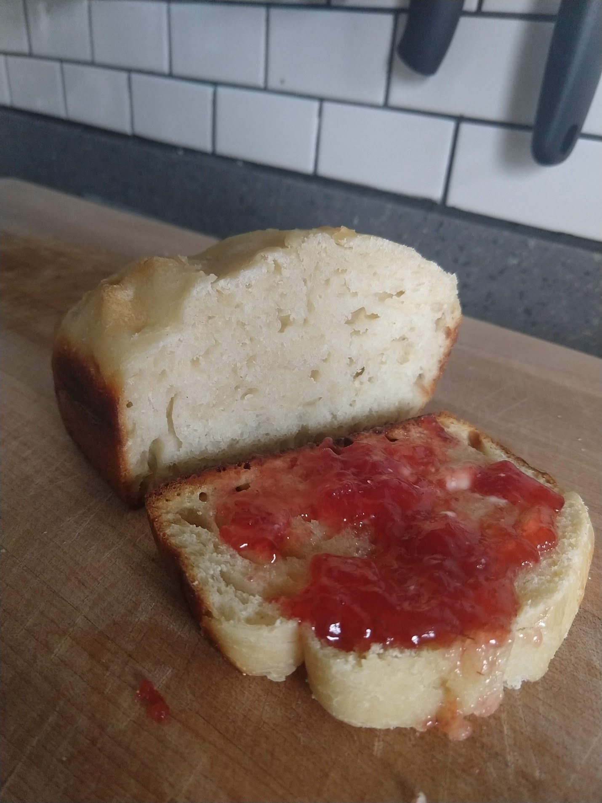

# Amstel Bread

Author: Alex Recker

I proudly offer my recipe for Amstel bread - reliable, consistent, and
low maintenance - it's like the M16 of dinner sides.  It makes a small
loaf that serves about 4-5 people, and it's incredibly easy to throw
together.  No kneading required and very conservative with yeast.

I usually throw it together around 11 PM.  That way, it's ready to
proof by 4 PM and ready to bake by dinner time.

This works with **any beer**, although I'd recommend you'd stick to
light beer.

## Materials

- water, cold (0.25 cups)
- Amstel light (0.25 cups)
- yeast, dry active (0.25 tsp)
- sugar (1 tsp)
- kosher salt (1.50 tsp)

## Procedure

1. Add all ingredients into a bowl.  Mix with a stand mixer and dough
   hook for 30 seconds, or by hand until the dough comes together in a
   sticky ball.
   
2. Cover the bowl tightly in tinfoil.  Set aside in a room temperature
   place.  If you have a drafty house, a turned off oven works well.
   Let the yeast rise for approximately **18 hours**.
   
3. Remove the tinfoil.  Using a rubber spatula, deflate the dough by
   scraping the sides and turning it over onto itself a few times with
   a folding & wiping motion.
   
4. Scrape the sticky dough into a lightly oiled loaf pan.  Tap the pan
   on the counter to remove air bubbles, and gently smoothen the top
   with the spatula.

5. Using a basting brush, lightly brush the top surface of the dough
   with oil.
   
6. Cover with tinfoil and set aside to proof at room temperature for
   approximately **2-3 hours**.
   
7. Bake at **450 F** for **35 minutes**.  When it is cooked through,
   the middle of the dough should sound hollow when flicked, like a
   bongo drum.
   
8. Remove from the coven to cool completely in the pan.  Serve with
   butter.
