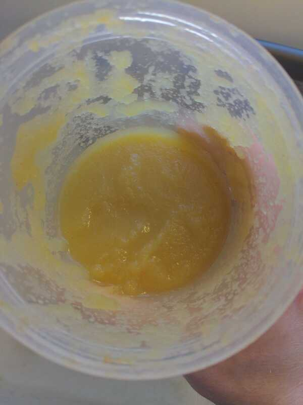

# Appelmoes

Author: Alex Recker

A timeless classic. Even if you're not down with putting it on
absolutely everything like the Dutch, this still makes for a delicious
breakfast or midnight snack.

A few tips for getting it right:

- The key is to use _just enough_ lemon juice to preserve the apples
  without canceling out the sugar.  If you apple sauce turns brown
  like an old banana, you used too little lemon.  If it tastes sour, you
  used too much lemon.
- The apple sauce gets sweeter as you leave it in the fridge.  It
  tastes bests after its been chilled and left in the fridge for at
  least a few hours.

## Materials

- fuji apples, peeled and cored (6)
- lemon (1)
- cinnamon (2 tsp)
- nutmeg (0.5 tsp)

## Procedure

1. Dice apples and add to a microwave safe container along with _most_
   of the juice from a lazily squeezed lemon.
2. Add nutmeg and cinnamon.
3. Cover the container loosely and microwave on high for 5 minutes.
4. Transfer apple pieces and juice to a container and blend thoroughly
   with a stick blender.
