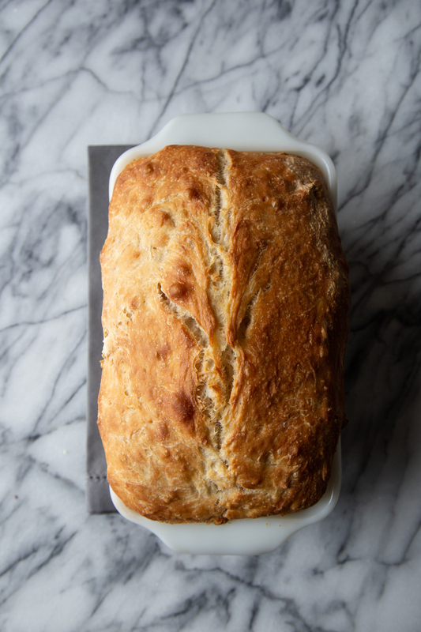
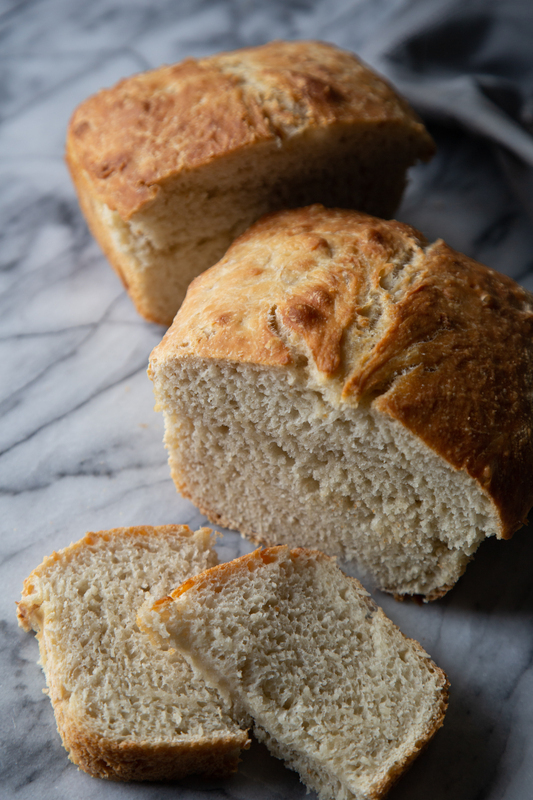

# Amstel Bread

Author: Alex Recker

I proudly offer my recipe for Amstel bread - reliable, consistent, and
low maintenance - it's like the M16 of dinner sides.  It makes a small
loaf that serves about 4-5 people, and it's incredibly easy to throw
together.  No kneading required and very conservative with yeast.

I usually throw it together around 11 PM.  That way, it's ready to
proof by 10 AM and ready to bake around lunch time.

This works with **any beer**, although I'd recommend you'd stick to
light beer.

## Materials

- water, cold (1 cup)
- Amstel light (1 cup)
- yeast, dry active (0.50 tsp)
- flour, all purpose (4 cups)
- kosher salt (3 tsp)

## Procedure

1. Add all ingredients into a bowl.  Mix with a stand mixer and dough
   hook for 30 seconds, or by hand until the dough comes together in a
   sticky ball.

2. Cover the bowl tightly in tinfoil.  Set aside in a room temperature
   place.  If you have a drafty house, a turned off oven works well.
   Let the yeast rise overnight.

3. Remove the tinfoil.  Using a rubber spatula, deflate the dough by
   scraping the sides and turning it over onto itself a few times with
   a folding & wiping motion.

4. Scrape the sticky dough into a lightly oiled loaf pan.  Tap the pan
   on the counter to remove air bubbles, and gently smoothen the top
   with the spatula.

5. Using a basting brush, lightly brush the top surface of the dough
   with oil.

6. Cover with tinfoil and set aside to proof at room temperature for
   approximately **2-3 hours**.

7. Remove foil.  Using a very sharp knife, make a slash down the
   middle of the of the dough surface about a quarter inch deep.  It
   doesn't need to be pretty - this only serves as a weak point to
   control where the cracking happens.

8. Bake at **450 F** for **35 minutes**.

9. Immediately remove from pan and cool on a rack.
