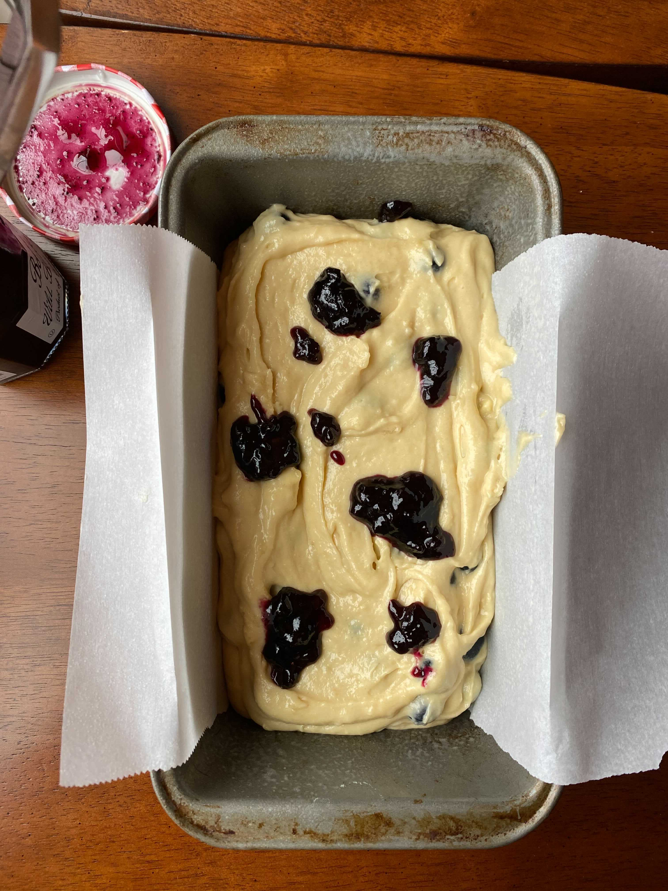
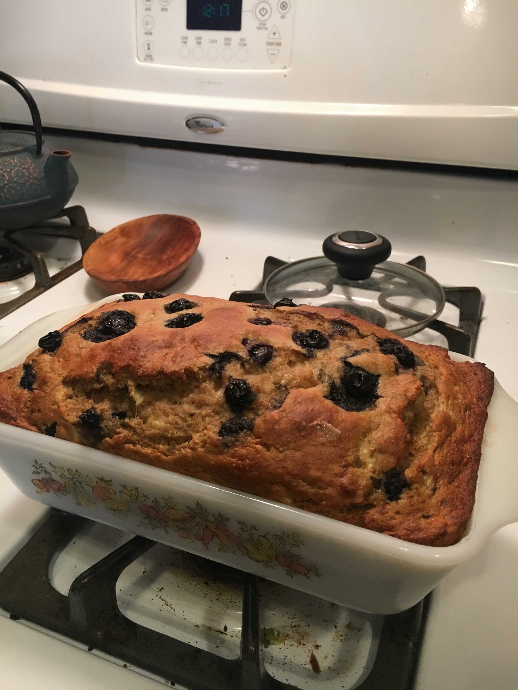

# Blueberry Muffin Bread

Author: Sarah Recker

## Materials

- all-purpose flour (2 cups)
- baking soda (1 tsp)
- baking powder (1 tsp)
- salt (0.5 tsp)
- butter, softened (0.5 cup)
- sugar (0.5 cup)
- brown sugar, light or dark (0.25 cup packed)
- large eggs, warmed[^1] (2)
- sour cream[^2] (0.5 cup)
- vanilla extract, (1.5 tsp)
- milk, room temperature (1/3 cup)
- blueberries, fresh (1.5 cups)
- optional: blueberry jam or finishing sugar

[^1]: leave at room temperature or run under hot water
[^2]: can substitute non-fat greek yogurt

## Procedure

1. Adjust the oven rack to the lower third position and preheat the
   oven to **350°F (177°C)**. Grease a 9×5-inch loaf pan or coat with
   nonstick spray. Set aside.

2. Whisk the flour, baking soda, baking powder, and salt together in a
   large bowl.

3. Using a handheld or stand mixer fitted with a paddle or whisk
   attachment, beat the butter, granulated sugar, and brown sugar
   together on high speed until smooth and creamy, about 2 minutes.

4. On medium speed, add the eggs one at a time, beating well after each addition.

5. Beat in the sour cream and vanilla extract on medium speed until
   combined.

6. With the mixer running on low speed, add the dry ingredients and
   milk into the wet ingredients and beat until no flour pockets
   remain. Fold in the blueberries.

7. Spoon the batter into the prepared baking pan. Either sprinkle
   liberally with fancy crunchy sugar, or swirl in some blueberry jam
   dollops on top with a toothpick or butter knife, or both!

8. Bake for 60-65 minutes, loosely covering the bread with aluminum
   foil at the 30 minute mark to help prevent the top and sides from
   getting too brown. A toothpick inserted in the center of the loaf
   will come out clean when the bread is done. Remove from the oven
   and allow the bread to cool completely in the pan set on a wire
   rack.

9. Cover and store bread at room temperature for 2 days or in the
   refrigerator for up to 1 week.

## References

- [Sally's Baking Addiction: Blueberry Muffin Bread](https://sallysbakingaddiction.com/blueberry-muffin-bread/)
