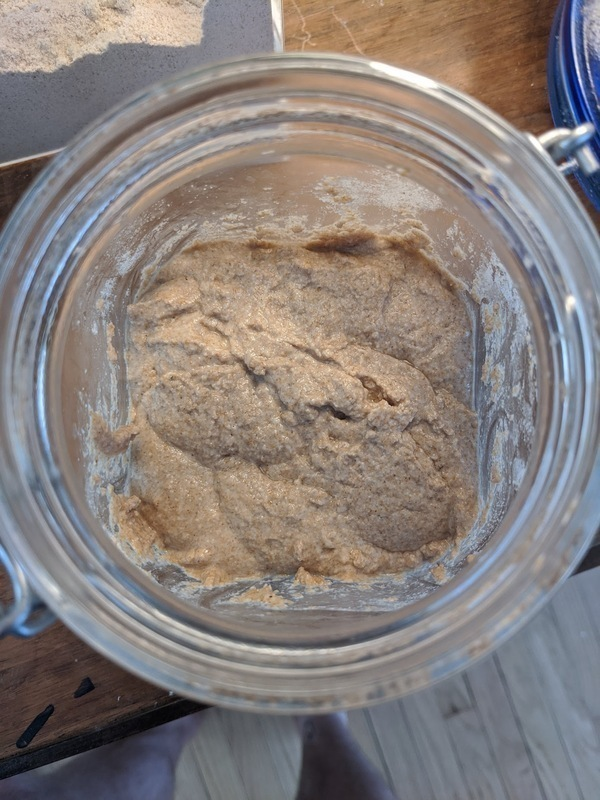

# Krang

Author: Alex Recker

_Krang_ is a culture of wild yeast started during the 2020 coronavirus
pandemic.  He shares a name with the TMNT villain who resembles a
giant brain.

## Materials

- [King Arthur Whole Wheat Flour] (113 g)
- Water, cold (113 g)

## Procedure

### Development

It takes 5-10 days to make a starter from scratch, but all you need is
flour and water.  The smell with get worse, then better.

1. Add flour and water into a non air tight jar [^1].  Stir, ensuring
   that all the flour is wet.

2. Set aside in a warm place.

3. Repeat the feeding daily until the starter becomes gassy, smells
   fragrant, and resembles toasted marshmallow.  It may smell like old
   shoes for a while, but keep going.  If any pungent, boozy liquid
   forms on top, pour it off before conducting the feeding.

4. Once starter doubles in size throughout the day after a feeding, it
   is ready to use.

[^1]: should be loose enough to allow gas to escape, but covered
    enough to keep fruit flies out.

### Feeding

Recommended feeding schedule is daily at 9 AM, or weekly if kept in
the fridge at 9 AM.  Starter will rise throughout the day, peaking
between 7-8 PM (which is a great time to start a loaf of bread).

1. Give the mixture a stir, then weigh 113 g of starter into a bowl.

2. Stir in 113 g of water.

3. Discard the rest of the starter remaining in the jar by rinsing
   with hot water in the sink.  Add starter and water mixture back
   into the clean jar.

4. Add 113 g of flour and stir until all the flour is moist.

[King Arthur Whole Wheat Flour]: https://shop.kingarthurflour.com/items/king-arthur-premium-100-whole-wheat-flour-5-lb
