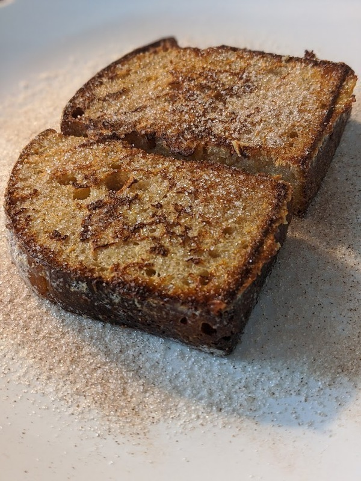

# French Toast

## Materials

- eggs (3)
- milk (1 cup)
- kosher salt (1 tsp)
- butter (1 tbsp)
- sugar (1/4 cup)
- cinnamon (1 tbsp)
- bread

## Procedure

1. Crack eggs into a bowl and beat until consistent.  Add a pinch of
   kosher salt and mix.
2. Pour milk into a separate bowl.  Add a pinch of kosher salt and
   mix.
3. In a separate bowl, mix sugar with cinnamon.
4. Melt butter in a non-stick pan over medium heat.  Swirl the pan so
   it is well-coated.
5. Once the butter is _hissing_, plunge a slice of bread into the
   milk, then shake the excess off.  Plunge the slice into the bowl of
   egg, and shake off excess.  Lay the slice in the butter.  Repeat
   for the remaining bread slices.
6. Flip each slice of bread once it has been browned and caramelized.
   Use the bread slices to soak up the remaining butter so it doesn't
   burn.
7. Remove the bread slices to a plate coated in the cinnamon sugar
   mixture.  Dump a little more cinnamon sugar on top and serve.
8. Serve immediately.  Wipe out the pan of any remaining butter before
   beginning another batch.

## References

- [French Cooking Academy: How to make traditional pain perdu]

[French Cooking Academy: How to make traditional pain perdu]: https://youtu.be/r2tQd2Txzf8
