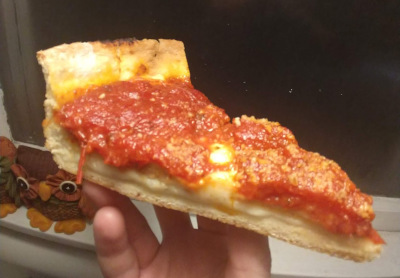

# Deep Dish Pizza

## Materials

- instant yeast packet (1)
- hot water (1 cup)
- white sugar (excess)
- butter (excess)
- finely ground corn meal (0.5 cups)
- kosher salt (excess)
- all purpose flour (3 cups)
- olive oil (2 tbsp)
- garlic (3 cloves)
- oregano (2 tbsp)
- red pepper flakes (3 tsp)
- tomato paste (2 tbsp)
- san marzano tomatoes w/ water (1 28 oz can, whole & peeled)
- pepper (excess)
- mozzarella (sandwich slices, 8)
- provolone (sandwich slices, 8)
- italian sausage (0.5 lbs, raw, no casing)
- parmesan (excess, grated, garnish)

## Procedure

### Dough (20 min)

1. Add one packet of instant yeast to 1 cup of hot water.  Add 2 TBSP
   of white sugar and allow the mixture to bloom for about ten minutes.
2. Add 1 TBSP of melted butter, 0.5 CUPS of finely ground corn meal,
   and two big pinches of kosher salt to the water, yeast, and sugar
   mixture.  Stir to combine.
3. Using a wooden spoon, stir in 2.5 CUPS of all purpose flour until
   the dough is shaggy.  Pour the dough out onto a lightly floured workspace.
4. Gently kneed the dough unti it is combined in a single mass, but it
   should still have a few cracks in it.  Place dough ball in a
   lightly oiled bowl, roll it around to coat, then cover the bowl
   with a plate for 1 HOUR.

### Sauce (45 min)

1. Cover the bottom of a dutch oven in olive oil.  Add three grated
   cloves of garlic and simmer gently for about five minutes.
2. Add about five heavy shakes of oregano, a shake of red pepper
   flakes (or to taste, if averse to spicy foods), and a big squirt of
   tomato paste.  Mix to combine and continue to simmer for 2 MIN.
3. Add an entire 28 OZ can of WHOLE PEELED SAN MARZANO TOMATOES.
   Break each tomato in half with the edge of a wooden spoon.
4. Turn the heat to HIGH until simmer is reached, then reduce the heat
   to medium low.  Reduce the sauce until you can part it in half with
   a wooden spoon.
5. Turn the heat to low, then add sugar, salt, and pepper to taste.
   The sugar will help curb the acidity of the concentrated tomato
   sauce, so don't be shy with it.  It should be about 2-3 TBSP.
6. Add 1 TBSP of butter and turn the heat to low.  Once the butter
   melts, turn the heat off and allow to cool.

### Pizza (45 min)

1. Pre-heat the oven to 400F.  As it heats, leave a 12 INCH CAST IRON
   SKILLET in the oven until it is just hot enough to melt butter.
   Remove the skillet and, using a fork, melt 1 TBSP of butter all
   along the bottom and sides of the pan.  Set aside to cool.
2. Remove the dough from the bowl and transfer to a floured table
   top.  Dust with flower until the surface of the ball is no longer moist.
3. Cut about 1/3rd of the dough off the ball and set aside.
4. Working the dough as little as possible, roll it out to about 1/4
   INCH thickness.  Carefully drape the dough over the buttered and
   cooled skillet and gently push it against the sides and bottom of
   the pan.  Since the dough is buttery, it may rip, but just use some
   of the dough you set aside to 'patch it'.  Give the dough a minute
   to settle into the pan.
5. Using a sharp knife, trim off the excess dough so that the top of
   the crust is flush with the top edge of the skillet.
6. Arrange 8 slices of mozzarella and 8 slices of provolone evenly
   around the bottom of the pizza.
7. On top the cheese, arrange 0.5 LBS of raw, bulk Italian sausage
   around the bottom, ripping it the meat into bite sized chunks and
   using your thumb to flatten them out against the bottom.
8. Using the remaining dough, roll out a small disk 1/4 INCH thick
   disk.  Gently place the dough disc at on top the cheese and the
   sausage.  It should not overlap with the sides.  Pinch the edges of
   the disc so it is flush with the crust.  Using a sharp knife, poke
   a few holes through the crust to allow steam to escape and prevent
   bubbling.
9. Gently ladle and spread the red sauce on top the pizza.  You should
   use almost all the sauce, but if it forms a pool on top the pizza
   than it's too much.
10. Bake the pizza at 400F for 30 MIN.  Remove from the oven and
    sprinkle with freshly grated parmesan cheese.  Allow pizza to cool
    for about ten minutes.
