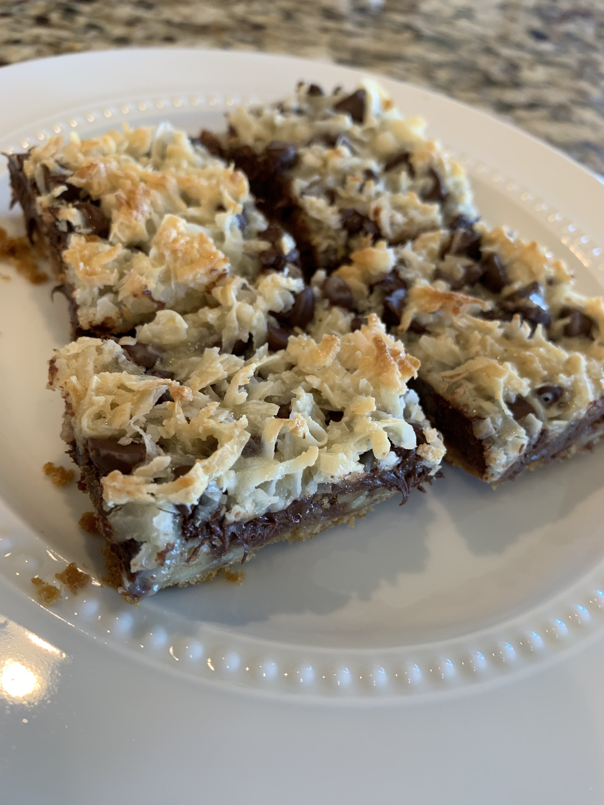

# Seven Layer Bars

Author: Jane Recker

"They should be called 6 layer bars Original recipe from 40 years ago
called for butterscotch chips but I hate those."

## Materials

- butter, melted in microwave (1 stick)
- graham cracker crumbs (1.5 cups)
- walnuts, chopped (1 cup)
- chocolate chips, semi-sweet (12 oz)
- coconut (1.25 cups)
- condensed milk (14 oz)

## Procedure

1. Preheat oven to **350 F**.

2. Pour butter into 9 x 13 pan.  Add graham cracker crumbs, patting
   them down into the butter so they are well-moistened.

3. Sprinkle in chopped walnuts, chocolate chips, and coconut.

4. Pour in condensed milk.  Be careful to make all the ingredients
   moist and even.

5. Bake for 20-25 minutes, watching carefully so the bars don't get
   too dark.
