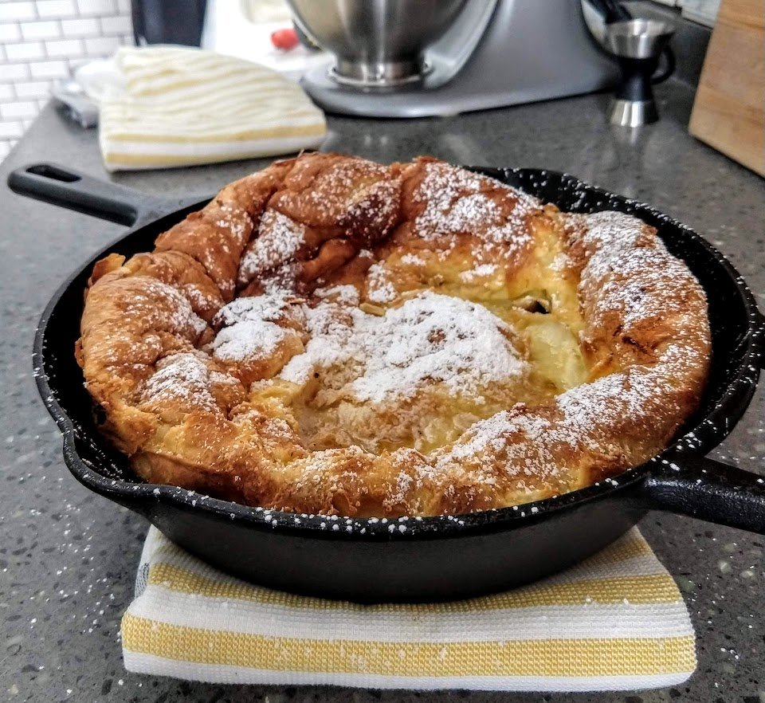

# Dutch Baby

## Materials

- clarified butter (3 tbsp)
- eggs (3)
- flour (1/2 cup)
- lemon
- milk (2/3 cup)
- powdered sugar
- salt (1/4 tsp)
- vanilla extract (1/4 tsp)

## Procedure

1. Warm eggs up in hot water until they are room temperature.
   Microwave the milk until it comes up to room temperature.
2. Combine milk, flour, eggs, salt, and vanilla extract in a blender
   and blend until smooth.
3. Heat a cast-iron skillet and add clarified butter.  Pour the batter
   directly in the center.  If the skillet is hot enough, it should
   bubble around the outsides.
4. Bake in a 425F oven for 20 minutes or until golden brown.
5. Serve immediately out of the oven.  Coat generously in powdered
   sugar and squeezed lemon.

