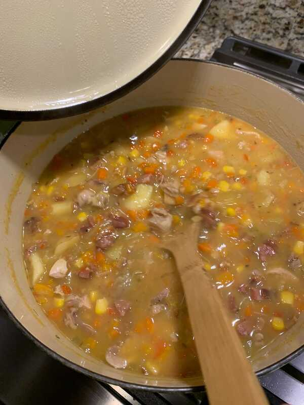

# Fricken Chiccasee

Author: Dirk Recker

## Materials

- red pepper, chopped (1)
- orange pepper, chopped (1)
- celery, chopped (1 cup )
- carrots, chopped (1 cup)
- shalots, finely chopped (½ cup)
- chicken thighs, boneless & skinless (5)
- bacon, baked & chopped (5 strips)
- andouille pork sausage, cooked & chopped (2)
- corn (½ can)
- lemon (1)
- wondra
- hot sauce[^1] (1 tsp)
- baby potatoes (2 lbs)
- chicken stock (1½-2 cartons[^2])
- _herbs de provence_
- lemon zest
- salt & pepper

## Procedure

### Chicken

1. Season chicken with salt, pepper, _herbs de provence_, lemon zest
   and lightly coat with olive oil.
2. In large Dutch oven, brown both sides of chicken thighs.  (they
   don’t need to be completely cooked through).
3. Take out of Dutch oven when both sides are browned and bake,
   covered in foil, 250 degree oven for 30 min.
4. Remove chicken, let it rest, and cut up in small pieces.

## Base

1. Saute carrots, celery and shallots in Dutch oven for about 5 min.  Let
   it absorb all that deliciousness from the chicken thighs.
2. Add the bell peppers.  Saute on medium with lid on Dutch oven about
   15 min.
3. Take lid off and cover veggies with half carton (carton is )
   chicken stock.  Put lid back on and cook for 15 min.  Then add rest of
   carton and cook again with lid on for 10 min.
4. Add hot sauce.
5. Squeeze juice from ½ lemon into pan.  Whisk and taste.
6. Add Wondra slowly to thicken and continue whisking.  It should
   begin to look like the inside of a pot pie.  Taste and add
   salt/pepper.  Use Wondra to thicken.
7. In the meantime, microwave baby potatoes until almost cooked
   through.
8. Cut in small pieces.  Add potatoes to pot, lid on, to finish
   cooking potatoes.
9. After cooking 10 min or so, check on it.  It’s probably getting too
   thick, so open 2nd carton of chicken stock and add more to thin it
   out.  Hard to say how much as this is an eyeball/taste thing.
10. As broth gets to desired thickness, add chopped, cooked chicken
    and the andouille sausage.

## Finishing

Keep tasting the broth – you want a hint of lemon and a little heat.
Continue cooking with lid on.  Potatoes need some time to get
completely cooked, and in the meantime, the broth will thicken.  This
might take up to 30 min.  Stove should be on low-medium now with lid
on.  Continue tasting broth, adding more lemon, or salt/pepper if
needed.  (You’ll probably use ½ the 2nd box of chicken stock).

At the end, add ½ can of drained corn, and chopped up cooked bacon.
If you want, add more Pepper Plant hot sauce.  Continue cooking.  Once
potatoes are at desired consistency, and broth is tasty, cook on
med-low with lid on for 20 min. – your end product should look like
the inside of a pot pie.

Enjoy on a huge piece of Trader Joe’s cornbread (made/baked
previously).

[^1]: Suggested hot sauce is Pepper Plant, but any will do.

[^2]: A carton is 32 oz.
