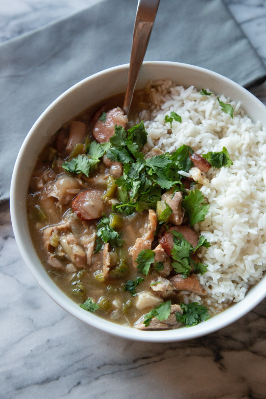

# Gumbo

Author: Alex Recker

A traditional cajun gumbo recipe, courtesy of the great Isaac Toups.
I highly recommend the instructional video he made for _Munchies_,
he's a delight to learn from.

## Materials

- vegetable oil (3 tbsp)
- flour (3 tbsp)
- celery, diced (1/4 cup)
- green bell pepper, diced (1/4 cup)
- white onion, diced (1/2 cup)
- garlic, chopped (6-8 cloves)
- light beer (1 bottle)
- chicken stock (2 cups)
- sausage, diced (1/2 cup)
- chicken thighs, boneless (4)
- bay leaves (3)
- salt
- pepper
- cilantro (garnish)
- rice OR orzo

## Procedure

1. Season the chicken thighs with salt and pepper.  Brush them with a
   little bit of oil and leave them on a stainless steel pan under the
   broiler for 20 minutes.  Remove the chicken and de-glaze with a
   splash of beer.  Slice the chicken and set aside with the juices.
2. Add vegetable oil to a heavy bottom cast iron pan and turn the heat
   on high.  Add flour.  Whisk constantly and thoroughly as a dark
   roux forms.
3. When the roux is the color of Hershey's chocolate (yes, really),
   turn the heat down to medium high and add the celery, peppers, and
   onions.  Add a pinch of salt.  Continue to stir with the whisk.
4. When the onions turn translucent, add the garlic and stir.  Turn
   the heat to high and add a half of a beer.
5. When the alcohol has burned off, add the chicken stock, sausage,
   sliced chicken, and bay leaves.
6. Bring to a boil, then turn the heat down to a gentle simmer.  Skim
   fat off the top.
7. Add thirty cracks of fresh black pepper.
8. Cover and leave to simmer for an hour.
9. Add salt to the gumbo to taste.

At this point, you have the option of just serving this with a tuft of
cilantro leaves over white rice or adding some orzo pasta.  The pasta
route is great because it adds a lot of comforting silkiness to the
broth.  For orzo pasta:

1. Dump in the pasta.  Stir it every few minutes to keep it from
   sticking to the bottom.
2. Serve when the orzo is tender.

## References

- [YouTube: How To: Make Chicken and Sausage Gumbo with Isaac Toups]

[YouTube: How To: Make Chicken and Sausage Gumbo with Isaac Toups]: https://youtu.be/76JXtB7JFQY
