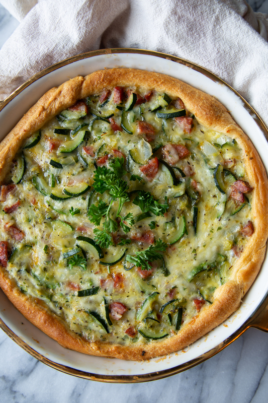

# Italian Zucchini Crescent Pie

Author: Jane Recker

I’ve mastered the zucchini crescent pie with added chicken sausage!
You can also probably add whatever veggies you want to this too.  It's
definitely a good base to change it up a bit each time you make it.

## Materials

- butter (2 tbsp)
- zucchini, thinly sliced (4 cups)
- onions, chopped (1/2 cup)
- parsley, dried flakes (2 tbsp)
- salt (1/2 tsp)
- pepper (1/2 tsp)
- garlic powder (1/4 tsp)
- dried basil (1/4 tsp)
- dried oregano (1/4 tsp)
- eggs (2)
- mozzarella cheese, shredded (2 cups)
- Pillsbury crescent rolls (1 can) [^1]
- yellow mustard (2 tsp)

[^1]: I'm sure if you make your own crust, it would work too.  I don't
    like making dough, so this worked for me.

## Procedure

1. Heat oven to 375 F degrees.  In 12-inch skillet, melt butter over
   medium-high heat.  Add zucchini and onions and cook 10-12 min
   stirring occasionally till tender.  Shut heat off and stir in
   parsley, salt, pepper, garlic powder, basil and oregano.  Set
   aside.

2. In large bowl, beat eggs with fork.  Add cheese.  Then add cooked
   vegetables and meat.  Gently mix with spatula.
   
3. Separate dough into triangles and place in un-greased pie plate.
   Press over bottom and sides and firmly press perforations to seal.
   Spread crust bottom with mustard.  Pour egg mixture into crust.
   
4. Bake 20 min and check.  If crust is getting too dark, cover edge of
   crust with tin toil last few min. till knife inserted into center
   comes out clean.  I like it dark on top.  I probably had it in the
   oven 30 min total.
