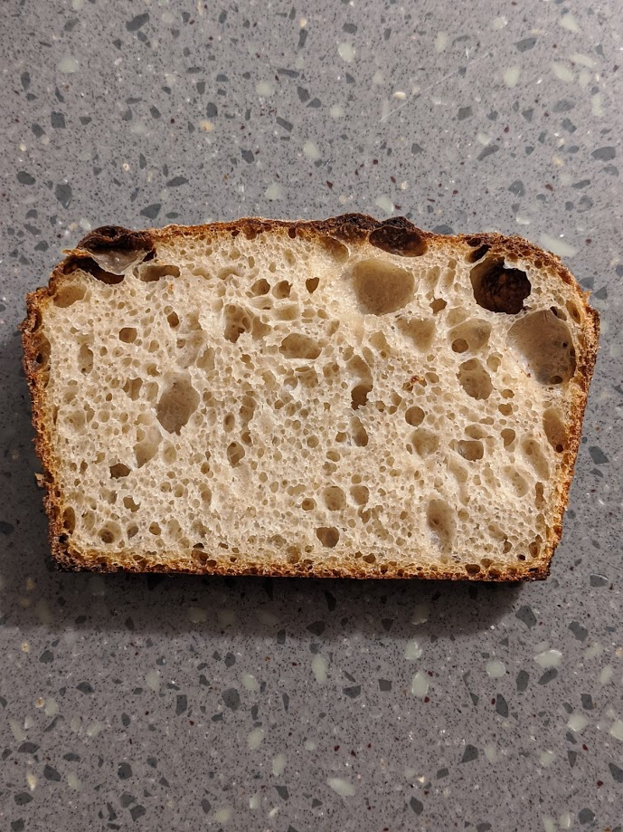
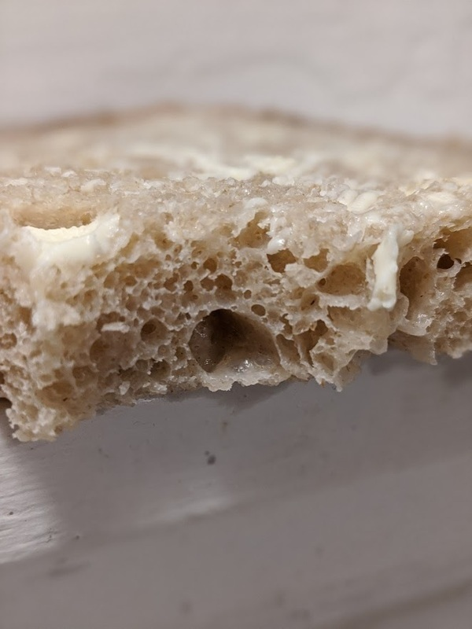

# Krang Bread

Author: Alex Recker

Krang Bread is a simple, no fuss, versatile sourdough.  It's makes as
good of a sandwich, as it does french toast, as it does regular toast,
and at the end of the day it still tastes great with just a swipe of
butter.

## Materials

- [krang][^1] (113 g)
- water, cold (548 g)
- kosher salt (13 g)
- bread flour (652 g)

[^1]: Or any 100% flour weight sourdough starter

## Procedure

1. Combine all ingredients in a large, wide, flat bottomed container.
   Use your hands to incorporate until all the flour is mixed and it
   comes together in a shaggy dough, but don't knead.  [7:00 PM]

2. Cover the container and leave to rest for 30 minutes. [7:30 PM]

3. Remove the lid and fold the dough.  With wet hands, stretch the
   dough as far as it will go without breaking, pulling it over the
   top and to the other side.  Go top to bottom, bottom to top, left
   to right, right to left, then flip the dough over like a pillow.
   Flatten at the bottom of the container, then cover to rest for
   another 30 minutes. [8:00 PM]
   
4. Fold the dough every 30 minutes for the next few hours.  After
   about 4-5 hours, it will become soft, smooth, shiny, and it won't
   stick as much.  Remove from the bowl and fold into a log on a wet
   counter.  Drop it into an oiled 10x5 in. pan seem side down.
   Refrigerate covered in foil overnight. [12:00 AM]
   
5. Remove pan from fridge.  Leave at room temperature until the dough
   reaches just below the top of the pan.  The top should be bubbly
   and very runny.  Should take 4-5 hours. [7:30 AM]
   
6. Bake at 450F for 45 minutes, uncovered.  Immediately remove from
   pan and leave to cool on a rack. [11:30 AM]

[krang]: krang.md
