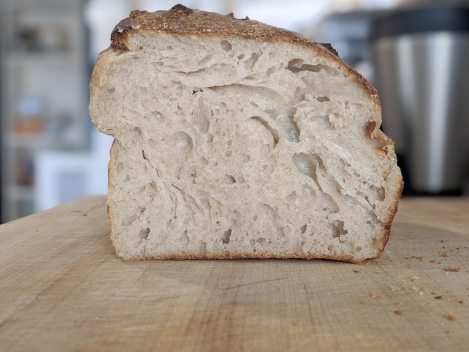

# Krang Bread

Author: Alex Recker

Krang Bread is a simple, no fuss, versatile sourdough.  It's makes as
good of a sandwich, as it does french toast, as it does regular toast,
and at the end of the day it still tastes great with just a swipe of
butter.

## Materials

- [krang][^1] (113 g)
- water, cold (548 g)
- kosher salt (13 g)
- bread flour[^2] (652 g)

[^1]: Or any 100% flour weight sourdough starter
[^2]: Can also cut with any amount of wheat flour by weight.

## Procedure

1. Combine water and starter in a large container.  Use your hands to
   break up the starter until it dissolves completely in the water.

2. Add the flour.  Mix with your hands until all the flour is wet.
   Cover and set aside to rest for 30-45 minutes.

3. Remove the lid and add the salt.  Fold the dough.  There are plenty
   of videos on how to fold dough, so watch a few and pick your
   favorite, they're all good.

4. Fold the dough every 30 minutes for the next few hours.  After
   about 3-4 hours, it will become soft, smooth, shiny, and it won't
   stick as much.  Remove from the bowl and fold into a log on a moist
   counter, and allow it to rest for 15 minutes.

6. With wet hands, roll the dough into a log and drop it into a 10x5
   in. pan lined with parchment paper.  Using wet fingers, tuck the
   sides of the dough down to the bottom of the pan.  Cover tightly in
   foil and leave in the fridge overnight.

7. Remove pan from fridge.  Leave at room temperature until the dough
   reaches just below the top of the pan.  The top should be bubbly
   and very runny.  If possible, leave it in a warm spot or in a
   slightly warmed oven.  Should take 2 hours.

8. Bake at 450F for 40 minutes, uncovered.  Immediately remove from
   pan and leave to cool on a rack.

[krang]: krang.md
