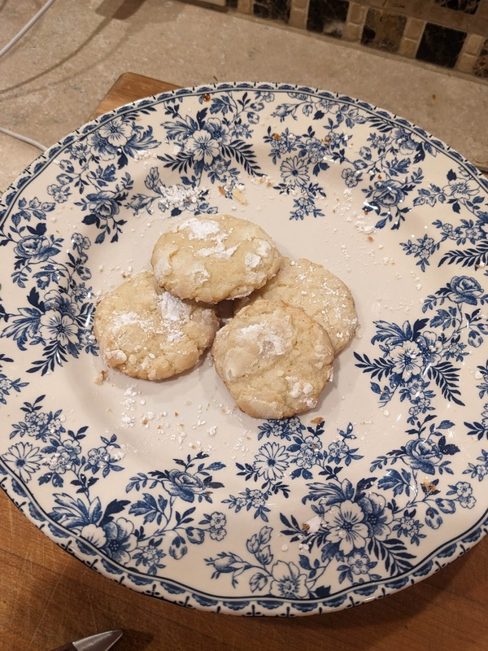

# Lemon Cookies

Author: Marissa Recker

This recipe makes 2-3 dozen small cookies.

## Materials

- butter, completely melted (1/2 cup or 1 stick)
- white sugar (1 cup)
- vanilla extract (1 tsp)
- egg (1)
- lemon (1)
- table salt (1/4 tsp)
- baking powder (1/4 tsp)
- baking soda (1/8 tsp)
- flour, all purpose (1.5 cup)
- powdered sugar (0.5 cup)

## Procedure

1. Pre-heat the oven to 350F.

2. Add butter and sugar to large bowl.  Mix until creamy, then add vanilla and egg and mix until fully combined.

3. Add all the juice from one half of the lemon to the mixture.  Add all the zest from the entire lemon.  Stir until fully combined.[^1]

4. Slowly add all the flour, baking soda, baking powder, and salt and stir until just combined.  Be sure to scrape the sides of the bowl to combine everything.  At this point, a wet dough ball should form.

5. Pour out all the powdered sugar into a bowl.

6. To form the cookies, pull out a chunk of wet dough with one hand and drop it into the bowl of powdered sugar.  Once the ball is coated, lightly roll it in your hands and place it on a greased baking sheet.  Do this for the whole dough ball, placing the cookies about 2 inches apart.

7. Bake for 8-10 minutes.  Take them out just before the edges start to become golden brown.

8.  Let cookies cool on the pan.  Remove with a spatula once they are solid.

[^1]: the dough might look grainy at this stage.  Don't worry, this is just the acid from the lemon.  It will look normal after you add the rest of the ingredients.

## References

- [LDS Living Lemon Crinkle Cookie](https://www.ldsliving.com/lds-living-lemon-crinkle-cookie/s/64185)
