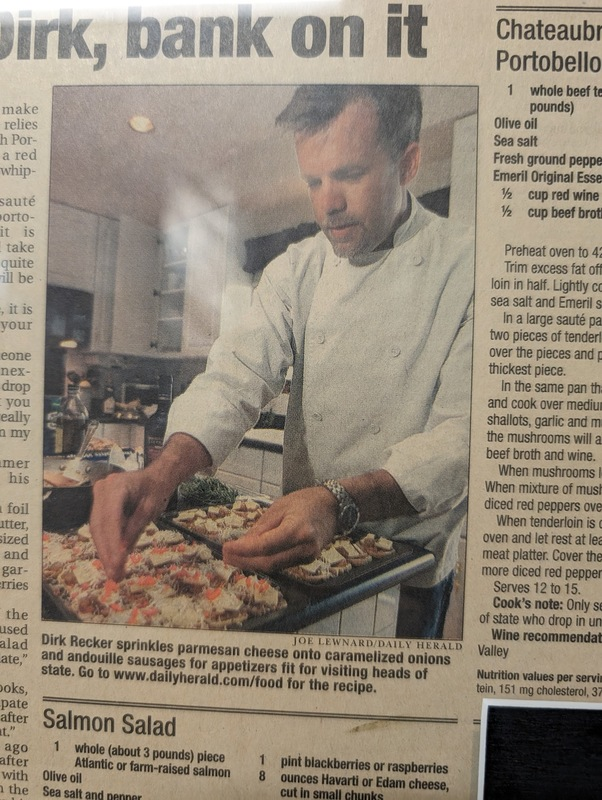
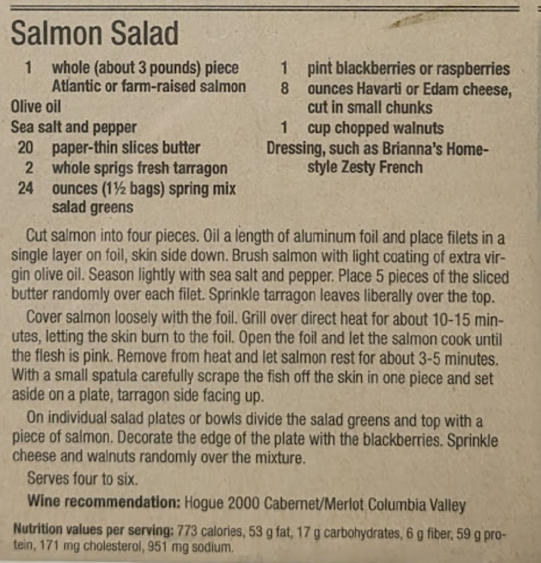

# Dirk's Salmon Salad

As featured in _The Daily Herald's_ "Cook of the Week"

Author: Dirk Recker, written by Joe Lewnard

Notes:

- serves: four to six
- recommended wine pairing: Hogue 2000 Cabernet/Merlot Columbia Valley

## Materials

- salmon, whole, Atlantis or farm raised (3 lbs)
- olive oil
- sea salt
- pepper
- butter, paper thin slices (20 pieces)
- terragon, fresh (2 sprigs)
- spring mix (24 oz or 1.5 bags)
- blackberries or raspberries (1 pint)
- havarti or edam cheese, cut small chunks (8 oz)
- walnuts, chopped (1 cup)
- Brianna's Home-style Zesty French dressing

## Procedure

1. Cut salmon into four pieces.  Oil a length of aluminum foil and place filets in a single layer on foil, skin side down.  Brush salmon with light coating of extra virgin olive oil.  Season lightly with sea salt and pepper.  Place 5 pieces of the sliced butter randomly over each filet.  Sprinkle terragon leaves liberally over the top.

2. Cover salmon loosely with the foil.  Grill over direct heat for about 10-15 minutes, letting the skin burn to the foil.  Open the foil and let the salmon cook until the flesh is pink.  Remove from heat and let salmon rest for about 3-5 minutes.  With a small spatula, carefully scrape the fish off the skin in one piece and set aside on a plate, terragon side facing up.

3. On individual salad plates or bowls divide the salad greens and top with a piece of salmon.  Decorate the edge of the plate with blackberries.  Sprinkle cheese and walnuts randomly over the mixture.

