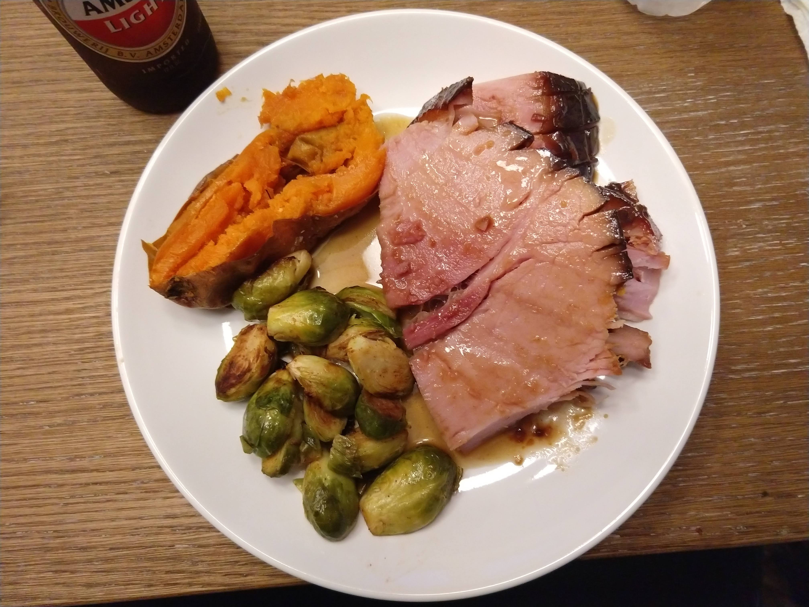

# Holiday Ham

Author: Alex Recker

Make a big, crispy, golden ham that would make Norman Rockwell proud.

## Materials

- ham, bone-in & cooked (1)
- star of anise (6)
- cloves (6)
- brown sugar (1 cup)
- honey, (0.25 cup)
- dijon mustard (0.25 cup)
- rice vinegar (2 tbsp)
- cayenne (pinch)
- pepper (1.5 tsp)
- worcestershire (dash)

## Procedure

1. Fill the bottom of a roasting dish with water and add a few star of anise and whole cloves.

2. Place the ham on the roasting dish. Score with a knife in all directions a half inch apart, a quarter inch deep.  Bake ham at **325 F for 20 min**.

3. In a separate mixing bowl, add brown sugar, honey, mustard, rice vinegar, cayenne, pepper, and Worcestershire sauce. Mix into a thick glaze. Keep adding rice vinegar until the glaze is at brushing consistency.

4. Remove the ham from the oven and brush with the glaze. Bake the ham another **20 minutes at 325 F**. Repeat this until the ham reaches an internal temperature of **130-140F**

5. Caramelize the glaze with the broiler or with a blowtorch.

## References

- [Food Wishes: How to Make a Honey Baked Holiday Ham](https://www.youtube.com/watch?v=kL6CjHLDK2M)
