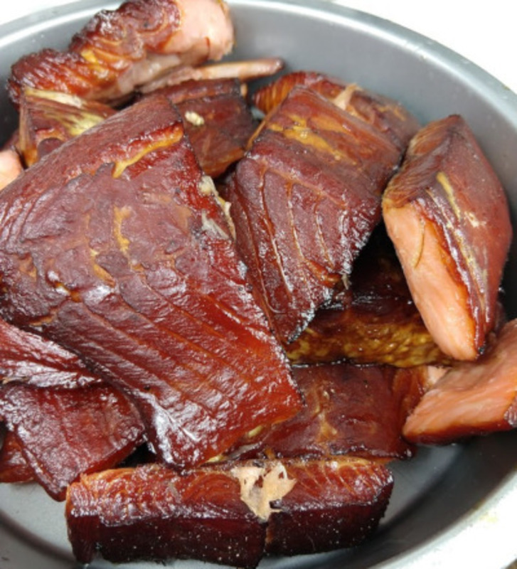

# Smoked Salmon

## Materials

- salmon (3 lbs, skin on)
- sugar (0.5 cups)
- brown sugar (0.5 cups)
- kosher salt (1 cup)
- crushed peppercorns (1 TBSP)
- charcoal (ex)
- applewood (ex)

## Procedure

1. Combine sugar, brown sugar, and salt in a bowl.  Mix well.
2. Halve salmon filets and wrap tightly in a plastic bag, thoroughly coated in the brine.  Ensure the skin sides of the filets are on the outside.
3. Leave in the fridge for twenty four hours, weighed under a brick.
4. Take salmon out of the fridge and rinse brine off.  Cut into strips and set aside to dry for a few hours.  The process can be expedited with a fan.
5. Prepare a Weber grill to smoke.  Build a barrier between the fish and fire with bricks, and gently bring charcoal and applewood up to a heat between 150-160F.  Smoke gently until the internal temp of the fish is 140F or until it falls off the skin.
