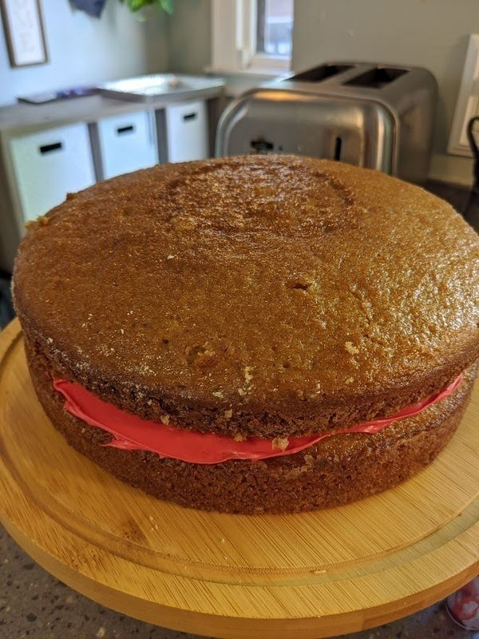

# Mistake Cake

Author: Alex and Marissa Recker

On the night before Rodney's fourth birthday, Marissa found this
random chocolate cake recipe to try.  To help save time while prepping
for the party, I set up the ingredients for her ahead of time.  But I
spaced out and omitted about 80% of the cocoa powder from the recipe,
and you can imagine our surprise when our chocolate cake came out
vanilla (with just the faintest tint of hidden chocolate).  We tried
the correct recipe for his party a few days later, and we found we
actually preferred the "mistake cake" version over the actual
chocolate cake recipe.

Bake in two buttered and floured pie dishes and stack the final pieces
on top of each other.  If you'd like, seal the pieces together with
frosting or fruit, and I suspect since it's technically both vanilla
_and_ chocolate cake, it will pretty much go with anything and make
everyone happy.

## Materials

- all purpose flour (2 cups)
- sugar (2 cups)
- baking powder (2 tsp)
- baking soda (1.5 tsp)
- unsweetened cocoa powder (1 tsp)
- kosher salt (1 tsp)
- butter milk (1 cup)
- vegetable oil (0.5 cup)
- eggs (2)
- vanilla extract (2 tsp)

## Procedures

_Preheat oven to 350 F_

1. Add flour, sugar, baking powder, baking soda, cocoa powder, and
   kosher salt to a bowl or mixer.  Stir to Combine.

2. While mixing, add eggs, oil, vanilla extract, and buttermilk.

3. Over a period of five minutes, slowly add 1 cup of boiling water
   while mixing.

4. Pour the batter out into two lightly buttered and floured 9 inch
   cake pans.
   
5. Bake for 30 minutes at 350F.  Allow it to cool in the pan.

## References

- [The Best Chocolate Cake Recipe Ever]

[The Best Chocolate Cake Recipe Ever]: https://addapinch.com/the-best-chocolate-cake-recipe-ever/

