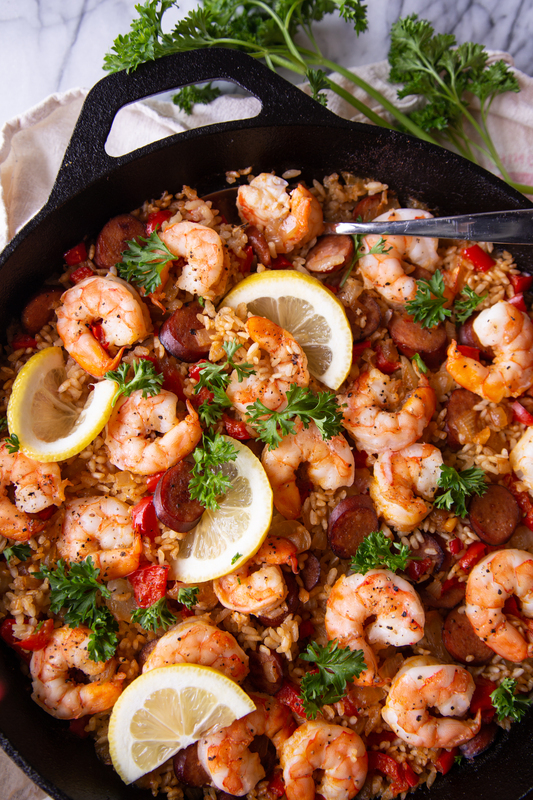

# Paella

Author: Alex Recker

This paella recipe is a Chef John classic.  Traditional paella is made
with a special paella dish, but I find that it works just as well with
a large cast iron skillet.  Take the following ingredients only as a
recommendation, as it pretty much works with any vegetables you have
at your disposal.

Only ingredient omitted is saffron.  If you have it, add a few to the
broth while you're infusing it with the shrimp shells.

## Materials

- raw shrimp, shells set aside (1 lb)
- chicken broth (2.25 cups)
- olive oil (ex)
- sausage, diced (8 oz)
- yellow onion, diced (1/2)
- garlic, minced (2 cloves)
- bell pepper, diced
- white rice (1.3 cups)
- paprika (ex)
- salt (ex)

## Procedure

1. Sautee the shrimp shells in olive oil until they turn red and
   smell fragrant.  Add all the chicken broth and simmer for twenty
   minutes.  Strain out the shrimp shells and set aside, keeping it
   warm in a pan.

2. Pre-heat the oven to 425F.

3. Add olive oil to a large, flat cast iron pan.  Brown the diced
   sausage in medium heat.

4. Add onion and bell pepper[^1].  Sweat for three minutes.  Turn up
   the neat if the pan is getting crowded.

5. Add the garlic, along with salt, pepper, and paprika.  Stir to
   combine.

6. Add exactly 2 cups of the warmed chicken broth to the pan all at
   once.  Avoid stirring the mixture from here on out.  Turn the heat
   all the way up, and while you wait for the mixture to simmer,
   arrange the shrimp around the top of the dish, pressing them into
   the rice.

7. Once the mixture is simmering, carefully place in the oven
   uncovered.  Bake for 20 minutes.

8. Remove the skillet from the oven and place it back on the stove.
   Cook over medium high heat for 3-5 minutes.  Allow to cool.

9. Serve with a wedge of lemon.  Be sure to include some of the bottom
   _Socarrat_ (burnt caramelized bits) on every plate.

[^1]: Also works well with carrots, celery, parsnip, and pretty much
	any other vegetable you have at your disposal.

## References

- [Food Wishes: Quick & Easy Paella]

[Food Wishes: Quick & Easy Paella]: https://www.youtube.com/watch?v=tiJMJznAi0Y
