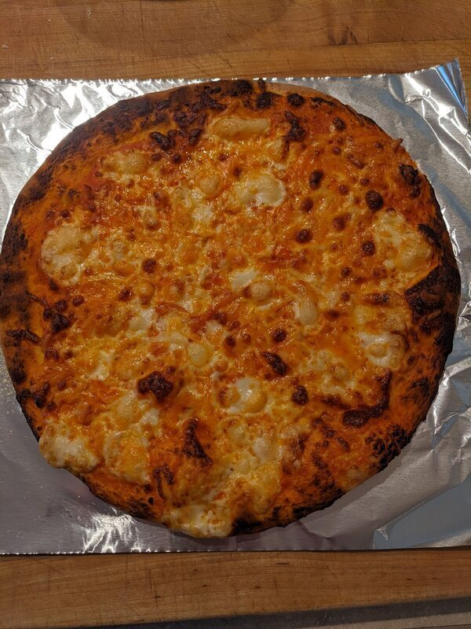

# Thin Crust Pizza

Author: Alex Recker

This is my thin crust pizza recipe.  It makes about four fourteen inch pizzas.  Use whatever toppings you want: thinly sliced red onions, fried pancetta, pork sausage, bell peppers.  The important thing about this recipe is the dough and the technique.

My recipe calls for bread flour, which makes for a much gummier crust.  Your dough won't puff up as much, but I think it yields a much better crust.

I like to proof the dough balls on a pan on top the stove.  While the oven is pre-heating to 500F, I get a nice jet blast of hot air on the back of the stove - just make sure you rotate the pan around every few minutes so the dough doesn't get too hot or you'll dry out the dough!

Another good move: you can use diced pancetta in the sauce.  Just fry it in olive oil at the beginning of the recipe and take it out before you add the garlic.  The pork fat really enhances the taste of the sauce, and the crispy pieces of pork make a good pizza topping.

## Special Equipment

- pizza peel
- pizza stone

## Dough

### Materials

- dry active yeast (1 packet)
- water, warm (2 cup)
- honey (2 tbsp)
- kosher salt (2 tsp)
- olive oil (2 tbsp)
- bread flour (excess)

### Procedure

1. Add water, yeast, and honey to a bowl.  Set aside for ten minutes until it shows bubbles.

2. Add salt and olive oil.  Stir.

3. Add a little bit of bread flour (about a half cup at a time) and stir into the liquid until it's smooth like a batter.  Keep doing this a little bit at a time until the batter turns into a shaggy dough.

4. Using a mixer or your hands, kneed the dough until it "cleans" the sides of the bowl.  Continue to kneed until the dough looks shiny and springs back to the poke.  Add flour when the ball gets too sticky.  It takes a while and it's a good arm workout, so enjoy it.

5. Place the dough ball in a lightly oiled bowl.  Cover tightly in tinfoil and leave in a warm place for two hours.

6. Take out dough and place on a lightly floured counter.  Cut the dough into four portions.  Folding the dough into itself from top to bottom (easiest to see in the referenced video), roll both portions into a small, smooth ball.

7. Leave dough out on floured plastic wrap or a silpat.  Cover loosely with lightly oiled plastic and then a towel.  Set aside in a warm place for 30 minutes.

## Sauce

### Materials

- olive oil (3 tbsp, or enough to cover bottom of pan)
- shallots, diced (3-4)
- kosher salt
- tomato paste (1 tbsp)
- oregano (1 tbsp)
- san marzano tomatoes, whole & peeled (1 28 oz can)

### Procedure

1. Add olive oil to a small sauce pan over medium low heat.  Add shallots and stir gently with a spoon.

2. Sweat down the shallots.  Add oregano and tomato paste.  Stir and cook for another minute.

3. Use a blender (immersion blender is easiest) to puree the can of tomatoes.  Turn the heat to high and dump the entire can in.  Using the same can, fill 1/4 of the way with water and add to sauce.

4. Bring the heat down and simmer gently while occasionally stirring for 20-30 minutes.  Add salt to taste.

5. Optional: purree the sauce with a blender again and add a whole basil stem while it cools.  Strain the sauce one final time.

## Pizza

### Materials

Obviously, the dough and the sauce made from the previous sections are required too.

- corn meal (excess)
- cheese, grated (to taste)

### Procedure

1. Place a 14 in. pizza stone on the oven rack.  Pre-heat the oven to 500F.

2. Move a single proofed dough ball to a lightly floured counter top.  Roll out smooth with a rolling pin.  If the dough fights back, just leave it on the counter under oiled plastic for a few minutes.

3. Transfer the flat dough to a pizza peel coated in corn meal.  Using a fork, stab the top of the pizza everywhere on the surface (this prevents giant bubbles from forming).

4. Give the flat dough a quick shake to ensure it's not sticking to the peel.  Using a ladel, cover the dough in a thin layer of red sauce.

5. Give the pizza another quick shake to ensure it's not sticking to the peel.  Cover lightly with shredded cheese.

6. Now the tricky part.  With a quick motion, slide the pizza off the peel and onto the pizza stone.  Let the pizza cook for ten minutes.

7. Take the pizza out and let it cool before slicing.

## References

- [Food Wishes: Wolfgang Puck Pizza Dough Recipe]

[Food Wishes: Wolfgang Puck Pizza Dough Recipe]: https://www.youtube.com/watch?v=lz8HlqYn98Q
