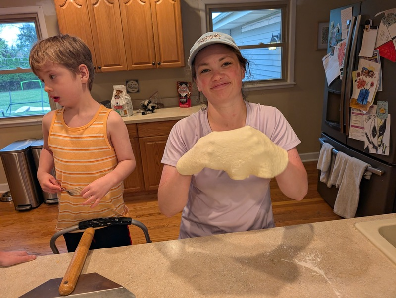

# Thin Crust Pizza

Author: Alex Recker

The Recker family thin crust pizza has had many iterations.  It may continue to change, but these constants remain: (1) it makes a huge mess in the kitchen and (2) it's delicious.

## Dough

### Materials

- dry active yeast (1 packet)
- water, warm (2 cups)
- kosher salt (2 tsp)
- olive oil (2 tbsp)
- honey (2 tbsp)
- bread flour (760g)

### Procedure

Pour warm water into a large mixing bowl.  Add half the yeast packet and discard the rest[^1].

Add kosher salt.

Add the olive oil, then the honey.  Use the same measuring spoon so that honey slides easily off the surface greased with oil.

Stir the mixture together.

Add a small amount of flour to the bowl.  Use a rubber spatula to stir the mixture until the flour is dissolved.

Continue to stir in small amounts of flour.  When you are about 80% through the measured flour, the mixture will transition from a thick batter to a shaggy dough.

Take a break from adding flour.  Keeping everything in the bowl, use one hand to smash the dough while the other hand turns the bowl in a circle.  Continue kneading, flipping, and rolling the dough - eventually the dough will become stickier.  With a light touch, roll the dough around so it "cleans" flour off the sides of the bowl.

Pour a small amount of flour onto the counter and dump the dough out on top.  Pour the rest of the flour on top of the dough.

Knead the dough by hand.  Use any method you want (there are lots of youtube videos for kneading pizza dough), but just make sure you keep smashing, stretching, and folding the dough.  By the time the dough ball has absorbed all the flour on the table, the dough should spring back to the touch (test this by poking an indent with your finger and watching for how fast the hole springs back).  Keep kneading the dough until it achieves a high level of spring, as this will make it much easier to roll the dough out later.

Pack the dough into a tight ball, then place it back in the mixing bowl.  Drizzle it with olive oil, then roll it around the bowl to coat the inside with oil.

Cover the bowl tightly with plastic wrap or tinfoil.  Leave in a warm place to bulk rise for 3 hours.  After 3 hours, lightly grease a large, clean countertop with olive oil.  Carefully dump out the dough and use a bench scraper to cut it into 4 equalish pieces.

Roll the pieces into smaller, tighter dough balls (watch a youtube video for how to do this).  Place them evenly around the counter and cover them with a piece of plastic wrap lightly greased with olive oil.

Let the dough relax/rise for 30-60 minutes (the longer the better, as long as they don't dry out).

## Sauce

This is a no-fuss pizza sauce made from scratch.  The recipe makes a little less than a quart - plenty for 4 pizzas and maybe even some leftovers for tomorrow morning's _Eggs in Purgatory_.

Vegetarians, feel free to skip the pancetta and simply use olive oil.

Poor people, feel free to skip the wine and just go straight to the tomatoes.

### Materials

- olive oil (3 tbsp, or enough to cover bottom of pan)
- pancetta, diced (4 oz)
- shallots, diced (3-4)
- kosher salt
- tomato paste (1 tbsp)
- oregano (1 tbsp)
- white wine (2-3oz)
- san marzano tomatoes, blended (1 28oz can)

### Procedure

In a cold, small sauce pan, add the olive oil and the pancetta.  Turn the heat to medium-high, stirring occasionally.

When the pancetta gets crispy, turn the heat off and remove the meat with a slotted spoon.  **Save the pancetta later, this makes for a delicious pizza topping.**

Turn the heat back to medium-high.  Add all the shallots and a pinch of kosher salt.  Stir the shallots, thoroughly sweating them (not frying them) for 5-10 minutes.[^2]

Turn the heat down to medium.  Add the oregano and tomato paste.  Stir the mixture together, occasionally flattening it out to let the tomato paste caramelize against the bottom of the pan.

Turn the heat to high.  Just before the mixture starts to burn, add in the wine.  Scrape the bottom of the pan clean.  Keep the heat up until the wine is almost completely evaporated.

Turn the heat down to medium.  Add the tomatoes.  Add cold water to the tomato can, swirl it around to clean, and add the remaining liquid to your sauce (if you waste san marzano tomatoes - even the little bit stuck to the sides of the can - you will be haunted by an Italian ghost).

Gently simmer the sauce for 30-60min, stirring occasionally.  Turn the heat off and blend, transfer the sauce into another container and blend with an immersion blender.  You may use the original tomato sauce can - it will fit perfectly and it won't spill onto your counter at all (trust me).

Strain the sauce back into the original sauce pan.  Use a ladel to help it through, tamping it down with a gentle circular motion.

Your sauce is now ready for the pizza.  Let it cool to room temperature and refrigerate for up to 4 days.

## Toppings

Toppings are up to you, but here are some general notes.

### Cheese

I like to use a large amount of primary cheese (mozzarella or scamorza) and a smaller amount of secondary cheese (gouda, cheddar, pecorino, anything in your cheese drawer).  It sounds counter intuitive, but go easy on the cheese.  To much cheese makes for a soggy pizza.  If you go with fresh mozzarella, it's a good idea to cut it into slices and dry it with paper towel - moisture is the enemy.

### Mushrooms

Raw mushrooms contain a lot of water, and this will leak out all over your pizza.  Some folks like raw mushroom on pizza, but I personally detest it.  If you'd like to follow our style, sautee or pan fry them first.

### Bell Peppers

I like to peel the bell peppers.  Did you even know you could do that?  I have success using a regular vegetable peeler, moving it back and forth on the edge until it catches the thin outer layer.  Removing the peel makes the pepper softer and helps it cook further during its short blast in the oven.

### Everything Else

Use whatever you want.  Smaller, thinner, drier pieces are always best.  Don't forget to chuck in the pancetta you used to make the sauce.

## Pizza

### Materials

In addition to the dough, sauce, and toppings:

- flour (excess, but small amount)
- corn meal (excess)

### Procedure

Place the pizza stone in the oven and pre-heat it to 500F.  Once the oven reaches temperature, leave the pizza stone in the oven for an addition 20 minutes.  When you are confident the pizza stone is hot enough, generously sprinkle the surface of the pizza peal with corn meal.

Sprinkle some flour on the counter and on your rolling pin.  Place the dough ball on top and roll it out flat.  If the dough ball wants to retract to the center, just let it rest on the counter for an additional 5 minutes.

Pick up the flattened dough and gently toss it around on your knuckles (just like they do it in the movies).

Carefully lay the dough flat onto the peel.  Give the peel a gentle shake to ensure the pizza will easily detach (you will need to slide it into the oven).  Use more cornmeal if needed.

Gently stipple the pizza dough with a fork, creating small indents all over the surface.  This will prevent large bubbles from forming in the dough when it cooks.

Ladle a scoop of sauce onto the center of the dough.  Using the back of the ladle, gently push the sauce around until it covers the entire surface of the dough - to the very edge of the crust!

Add your primary cheese, your secondary cheese, and any additional toppings.

Time to see how well you handle pressure.  Open the oven and slide the pizza off the peel into the center of the stone.

Bake the pizza for **12 minutes**.  Remove from the oven and let it cool for at least 5 minutes before slicing.

_We really botched this one, but I'm including it here in the cookbook to prove that even a terrible homemade pizza is still damn good pizza._

## References

- [Food Wishes: Wolfgang Puck Pizza Dough Recipe]

[Food Wishes: Wolfgang Puck Pizza Dough Recipe]: https://www.youtube.com/watch?v=lz8HlqYn98Q

[^1]: A 3 hour bulk rise yields great flavor, but if you are short on time, you can achieve a pretty decent dough in 1 hour.  Just use the entire yeast packet and leave the dough some place warm.
[^2]: Lesser dumbasses add sugar to their pizza sauce, where this recipe relies on the natural sweetness of shallots.  Take your time and be greedy - the longer you can sweat them, the sweeter your sauce will be.
