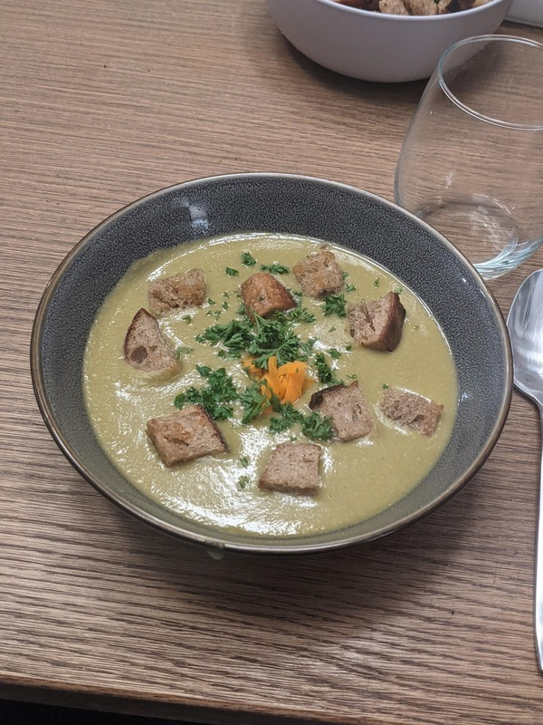

# Potage Saint Germain

Author: Alex Recker

_Potage saint Germain_ is a French take on pea soup.  It's great
during the winter, and work well as a main course or a side.

If you're going for style points, this dish is "graded" on how well it
retains its green color.  For this reason it's finished at the end
with butter, not cream.

## Materials

- split peas, dry (16 oz)
- white onion, chopped (0.25 cup)
- carrot, chopped (0.25 cup)
- leeks, just the green part, chopped (2 tbsp)
- pork belly[^1], chopped (0.25 cup)
- garlic, peeled & bruised (2 cloves)
- butter (ex)
- water or chicken stock, (2-3 cups)
- _bouquet garnis_ (optional)

[^1]: Also use pork shoulder, pork chops, or even bacon.  Set aside bones.

## Procedure

### Blanching the Peas

1. Add all peas to a saucepan.  Cover them in at least an inch of cold
   water.
2. Turn heat to high.  When the water is just about to enter a rolling
   boil, shut off the heat.
3. Drain the peas into a collander.  Rinse with cold water and set
   aside.

### Cooking the Soup

1. Add a notch of butter to a dutch oven over medium heat.  When the
   butter is cracking, add pork and stir.,
2. Sweat pork until it takes on color, then add the carrots, onions,
   and leeks.  Sweat until onions begin to turn translucent.
3. Add peas and water (or chicken stock).  Bring to a simmer, skimming
   off any scum that rises.
4. Add garlic and bouquet garnis or bones if available.
5. Close the lid and turn heat to medium low.  Simmer soup for 30
   minutes.
6. Add salt and pepper to the soup.  Close the lid and simmer for
   another 10 minutes.  By now the peas should be getting mushy.

### Preparing the Soup

1. Turn off the heat.  Remove bones and bouquet garnis if used and
   discard.
2. Thoroughly blend the soup with an immersion blender.
3. Pour the soup through a strainer into a second pot.  Use the back
   of a ladle to wring it through the strainer.
4. Add salt and pepper to taste while you warm the soup up.  Finish by
   stirring in a pad of butter.  Serve with pan fried croutons.

## References

- [French Cooking Academy: Potage saint Germain]

[French Cooking Academy: Potage saint Germain]: https://youtu.be/VHsF-bK9xsg
