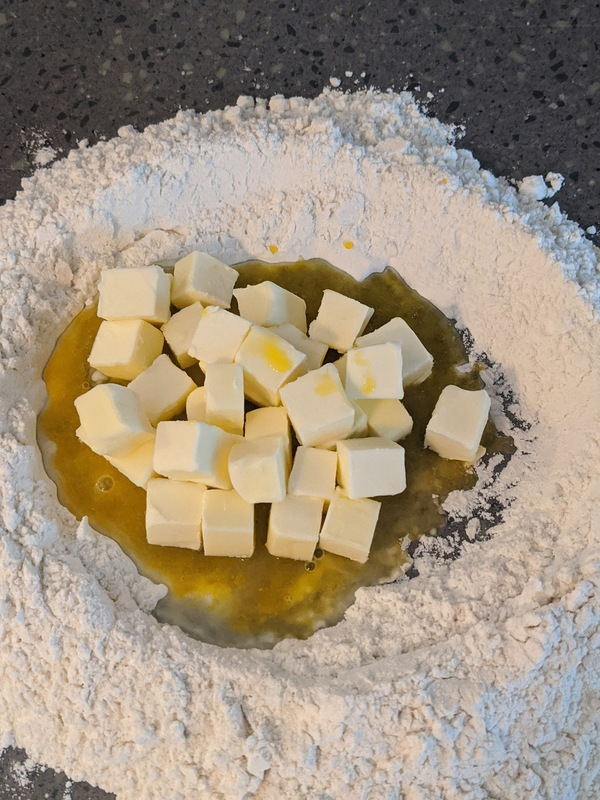

# Quiche Lorraine

Author: Alex Recker

This is a direct copy of the _Quiche Lorraine_ recipe from my online French cooking class.  It's probably a little more involved than the quiche you'd make for a casual brunch, but it can be kind of a fun way to show off for a small group of friends.  This recipe covers making the crust and the custard from scratch, but feel free to just use a store bought crust or add your own riff on the custard.  This makes more than enough dough and custard to fill a shallow 10 inch tart dish.

Also, I learned that a quiche can pretty much be garnished with _anything_, so long as the ingredients aren't sopping wet or overly salty.  Whatever you go with, just add it to the quiche right before you pour the custard in.  These are the garnishes I've tried:

- bacon
- leeks
- pancetta
- carmelized onions
- mushrooms
- cheese
- dill
- parsley

## Crust

The base of the quiche is a classic savory short crust.  This makes a pretty good pie crust, and you can easily use it for sweet recipes by adding sugar instead of salt.  After the dough rests, it's flattened with a rolling bin and blind baked in the tart dish ahead of time.

### Materials

- flour, all purpose (250 g)
- butter, unsalted, cold, cubed (125 g or a little more than a whole stick)
- egg yolk
- water, cold (3 tbsp)
- salt, kosher (1 tsp)

### Procedure

1. Mix egg yolk, water, and salt in a bowl.  Stir until combined.

2. Dump flour onto a clean tabletop.  Use your hands to dig a hole in the center, forming a flour "volcano".

3. Dump the egg, water, and salt mixture into the middle.

4. Dump the butter into the egg mixture.

5. Sprinkle some of the flour from the outside of the mound over the butter.  Pick up small chunks of floured and eggy butter into your hand and make a fist, squeezing it through your fingers.

6. Keep sprinkling, squeezing, and combining the butter.  Eventually a dough ball will form.  Once you notice the dough pulling away from your fingers, set the dough aside and discard the excess flour.

7. Flatten the dough into a thick disk.  Wrap it in plastic and leave in the fridge to rest (minimum of 2 hours, maximum of 12 hours).

8. Pre-heat the oven to 350F.  Remove the dough from the fridge.  **Do not let it warm up**.  Beat it into submission with a rolling pin and roll it out as evenly as you can to a thickness of 0.25 inches.  You can use flour to keep it from sticking.

9.  Use a rolling bin to transfer the flattened dough onto the greased tart dish.  Allow gravity to full the dough downward for a few seconds.  Trim the excess off the sides, then ball up the excess dough and use it to finally press the dough into the bottom and the sides.

10.  Stipple the bottom of the crust with a fork.  Line the dish with a loose piece of parchment paper and fill it in with uncooked white rice.  Bake the dough in the tart dish for 15 minutes.  You can store the blind baked crust in the fridge overnight until you bake the quiche.

## Custard

### Materials

- eggs (2)
- egg yolks (2)
- milk, whole (1 cup)
- heavy whipping cream (1 cup)
- salt, kosher
- mace (or nutmeg)
- cayenne pepper

### Procedure

1. Combine eggs, egg yolks, milk, and whipping cream in a bowl.  Whisk until combined.

2. Add a generous sprinkle of salt, mace, and cayenne pepper.

## Quiche

### Procedure

1. Pre-heat the oven to 400F.

2. Remove the blind baked quiche crust from the fridge.  Add in any garnish, if you have any.

3. Pour in the custard until it reaches the top of the crust.

4. Bake the quiche for 10 minutes.  Leaving the oven door closed, reduce the oven temperature to 350F.  Bake for an additional 25 minutes.

5. Let quiche cool for at least 40 minutes.
