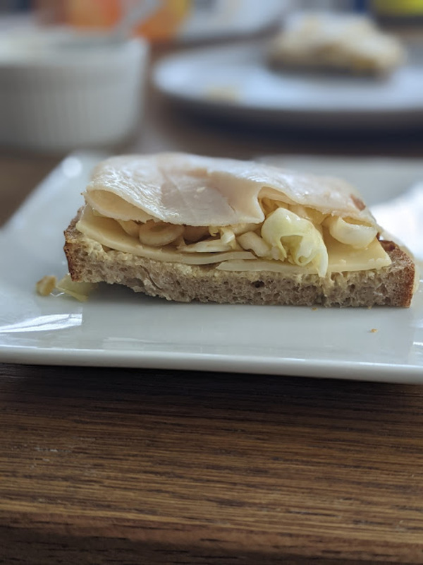

# Rissa's Sandwich

Author: Alex Recker

_Rissa's sandwich_, Marissa's favorite open faced turkey and swiss
sandwich, has been a staple of our quarantine lunches.  Best served
with a beer and a little pile of goldfish crackers.

## Materials

_Makes two open faced sandwiches._

- fresh sourdough bread (2 slice)
- mayo
- dijon mustard
- swiss cheese (2 slice)
- salt
- pepper
- garlic (~4 cloves)
- red pepper flakes
- olive oil (4 tbsp)
- balsamic vinegar (1 tbsp)
- green cabbage (half a head)
- turkey

## Procedure

### The Cabbage Salad

At the heart of the sandwich is a tangy cabbage french salad.  It
keeps for a few days in the fridge, and it works best in a medium
sized tupperware container - something you can shake vigorously.

1. Add sliced garlic to tupperware container along with olive oil,
   balsamic vinegarm, salt, pepper, and a few shakes of red pepper
   flakes.
2. Slice the cabbage and add to the tupperware container.  Just before
   assembling the sandwich, shake thoroughly to form the dressing and
   combine with the vegetables.

### The Sandwich

1. Start with two slices of fresh sourdough bread.  Smear them both
   with mayo and dijon mustard.
2. Add a slice of swiss cheese to each.
3. Add a mound of cabbage salad to each slice.
4. Seal the top of the sandwich with a large slice of turkey.
