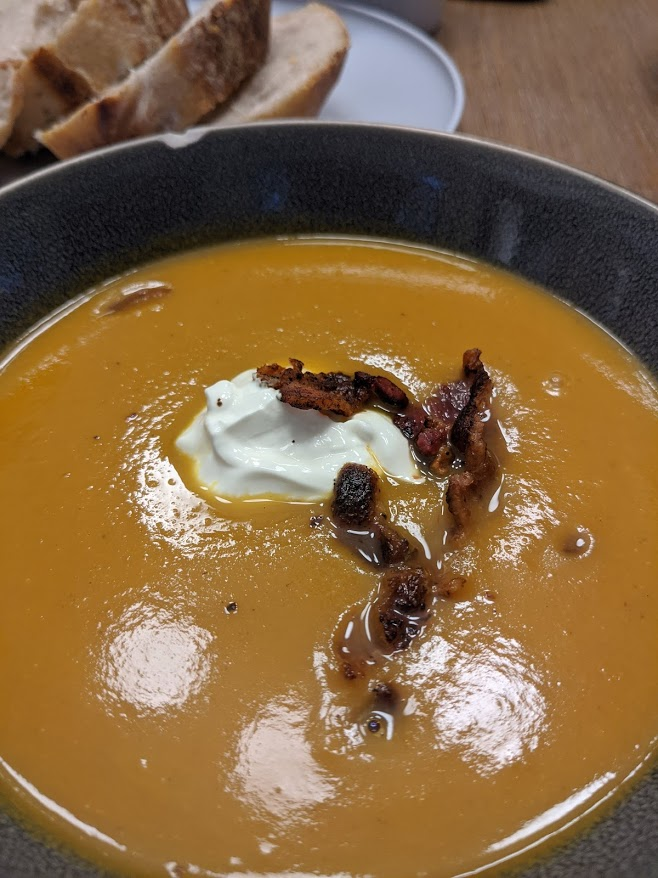

# Roasted Butternut Squash Soup

Author: Alex Recker

## Materials

- butternut squash (2 lb)
- sliced carrots (1 cup)
- roughly chopped onion (1 cup)
- garlic, peeled (6)
- butter (4 tbsp)
- sage (small amount of leaves)
- honey (1 tbsp)
- chicken broth (6 cups)
- apple cider vinegar (1 tbsp)
- salt (to taste)
- creme friache (optional)

## Procedure

1. Halve and pit butternut squash.  Add flesh side facing up to a
   lightly oiled roasting pan with carrots, onions, and garlic.  Salt
   the vegetables and top of the squash.  Roast the vegetables at 400F
   for an hour or until squash is tender.  Set aside to cool.
   
2. Melt 4 tbsp of butter in a pan over medium heat.  When the butter
   turns light brown, turn off the heat and throw in a handful of
   fresh sage leaves.
   
3. Scoop out squash flesh into the roasting dish and discard the
   skin.  Transfer everything in roasting dish into a soup pot and add
   the sage butter.  Add honey and chicken broth

4. Raise heat to a boil, then simmer gently for 45-60 minutes.

5. Blend with a stick blender until very smooth.  Pass soup through a
   sieve.  Add water, or reduce until soup is at the right thickness.
   
6. Add 1 tbsp of apple cider vinegar, a shake of cyan pepper, and add
   salt to taste.
   
7. Serve with a scoop of creme friache or sour cream.

# References

- [Food Wishes: Roasted Butternut Squash Soup]

[Food Wishes: Roasted Butternut Squash Soup]: https://youtu.be/AlRqh21CfHI
