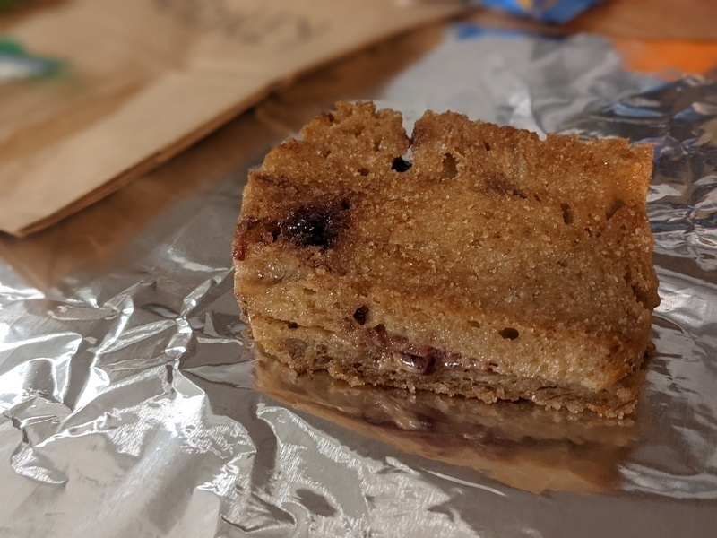

# Rodney Style

AKA the Rodney Style Peanut Butter and Jelly

Author: Alex Recker

This crustless, butter-fried, sugar-dusted peanut butter & jelly
sandwich delivers an excellent sugar rush, making it the perfect
pick-me-up for a Sunday lunch or an indulgent after school snack.

## Materials

- sourdough bread[^1], crust removed (2 slices)
- peanut butter (1 tbsp)
- jelly (1 tbsp)
- butter (1 tbsp)
- white sugar (1 tbsp)

[^1]: best with [Krang Bread](./bread/krang-bread.md)

## Procedure

1. Assemble a peanut butter and jelly sandwich with the bread and set
   aside.

2. Melt butter in a non stick pan over medium heat.

3. Add sandwich to the pan.  Flip and slide the sandwich around while
   it toasts, ensuring good heat dissipation and butter absorption.

4. Some oil may resolve out from the peanut butter.  Turn down the
   heat if think it may start to burn, but otherwise press on.  This
   oil just further fries the bread and makes it more delicious.

5. Once the bread the bread appears golden brown, turn off the heat.
   With the sandwich still in the pan, dust it with white sugar.
   Flip and slide the sandwich around so both sides get a good coating
   of sugar while it cools.

6. Cool the sandwich in the fridge while you assemble the rest of
   lunch.

[Krang Bread]: krang-bread.md
