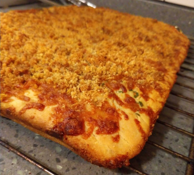

# Sfincione

_Sfincione_ is a pizza made with anchovies and onions, and it is
traditionally served in Sicily around Christmas.  We discovered it on
the Food Wishes YouTube channel and it has since replaced Friday night
delivery.  Always turns out great, no matter how you vary it or screw
it up.

## Dough

### Materials

- water, warm  (2 cups)
- yeast, active dry (1 tsp)
- kosher salt (1.5 tsp)
- white sugar (1 tsp)
- honey (1 tsp)
- olive oil (3 tsp)
- all purpose flour (4.3 cups)

### Procedure

1. Pour warm water into the bowl of a stand mixer and add yeast.
   Allow yeast to bloom for 10 minutes.
2. Add salt sugar, honey, olive oil, and flour.  Mix with dough hook
   for 6-7 minutes, occasionally scraping down the sides.  The dough
   should be very sticky, hugging the bottom of the bowl.
3. Cover in mixing bowl and leave in a warm place for 90 minutes.

## Sauce

### Materials

- olive oil (2 tbsp)
- yellow onion (1)
- red pepper flakes (1 tsp)
- tomato paste (1 tbsp)
- dried oregano (1 tsp)
- anchovy fillets, save oil (4)
- marinara sauce (1 26 oz jar) [^1]
- water (0.25 cups)
- kosher salt
- pepper

[^1]: if you don't have marinara, you can blend a 28 oz can of peeled
    tomatoes with salt, sugar, and a splash of balsamic vinegar.
    There's plenty of flavor in the sauce already - it won't make much
    of a difference.

### Procedure

1. Add diced onion, salt and olive oil to a large, deep saucepan.
   Heat for 6-7 minutes until the onions turn translucent.
2. Add pepper, tomato paste, anchovies, oregano, and red pepper
   flakes.  Stir and continue to heat until the anchovies disappear.
3. Add marinara sauce, using the water to rinse out the jar and
   combine.  Simmer sauce for 20 minutes and add salt and pepper to
   taste.
4. Turn the heat off and let cool, then pour into a blender.  Blend
   the sauce until smooth and set aside.

## Pizza

### Materials

- bread crumbs (0.75 cups)
- pecorino romano, finely grated (1 cup)
- mozzarella, shredded or torn (3 oz) [^2]
- provolone, shredded or torn (3 oz)
- basil, chopped or torn (excess)
- olive oil (excess)

[^2]: fresh mozzarella works well too, as long as it's used
    conservatively.

### Procedure

1. Preheat an oven to 400F.
2. Liberally coat a baking pan with olive oil.  After dipping your
   hands in oil (or an implement), carefully work the sticky dough out
   of the bowl, dumping it onto the baking pan.
3. Carefully stretch and tug the dough until it covers the baking pan.
   If it is springy, give it a few minutes to rest in between
   attempts.  Eventually the dough's weight will distribute itself
   evenly across the pan.
4. Evenly spread the sauce over the dough, stopping about an inch from
   the edge of the pan on all.  For best results, use the bottom of a
   soup ladle.
5. Throw some basil over the sauce.
6. Evenly cover the sauce in shredded mozzarella and provolone.
   Moisture is the enemy - go easy on the fresh cheese, but try to
   focus on the area between the sauce and the outside crust.
7. Combine the breadcrumbs with finely grated pecorino.  Add the
   leftover oil from the anchovies and combine with a fork.  Keep
   adding additional olive oil until the breadcrumbs are moistened.
8. Evenly cover the top of the cheese with the breadcrumb mixture.
9. Bake pizza uncovered on the middle rack for 30 minutes or until
   golden brown.  Transfer to a cooling rack to avoid getting the
   crust soggy.

## References

- [Food Wishes: Sicilian Christmas Pizza]

[Food Wishes: Sicilian Christmas Pizza]:https://www.youtube.com/watch?v=kfzi5Jcse98
