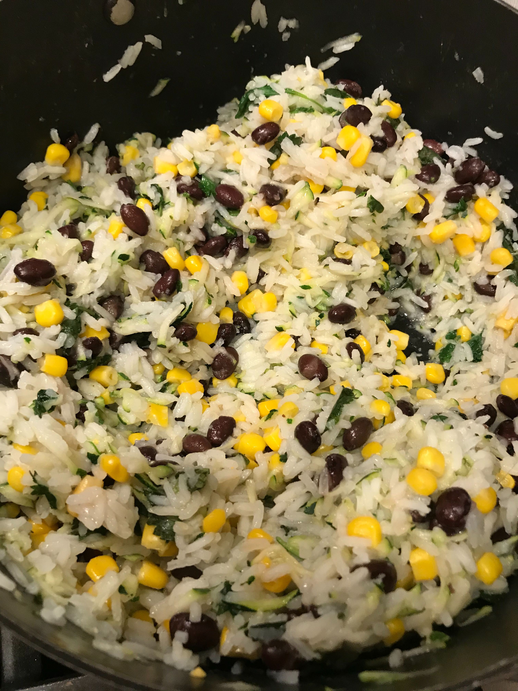
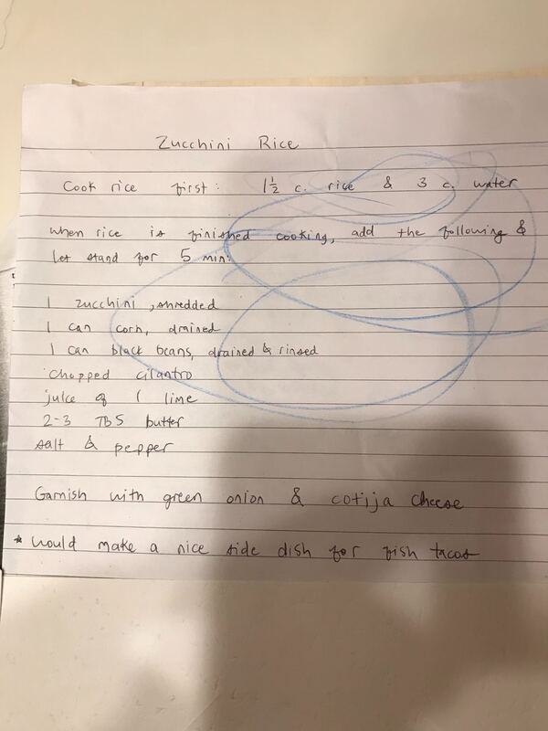

# Zucchini Rice

Author: Kelly Recker

This is Kelly's Zucchini Rice.  This is a great way to use up zucchini and cilantro, all while getting your kids to eat more veggies.  Goes great with tacos.

## Materials

- zucchini, shredded (1)
- canned corn, drained (1)
- canned black beans, drained/rinsed (1)
- cilantro, chopped
- lime, juiced (1)
- butter (2-3 tbsp)
- salt
- pepper
- green onion
- cotija cheese

### Rice

- white rice (1.5 cup)
- water (3 cup)

## Procedure

1. Cook rice with your favorite method.
2. Add zucchini, corn, beans, cilantro, lime, and butter.  Mix and add salt and pepper to taste.
3. Let sit for five minutes.  Serve with green onion and cotija.

