# Alex's Chili

Author: Alex Recker

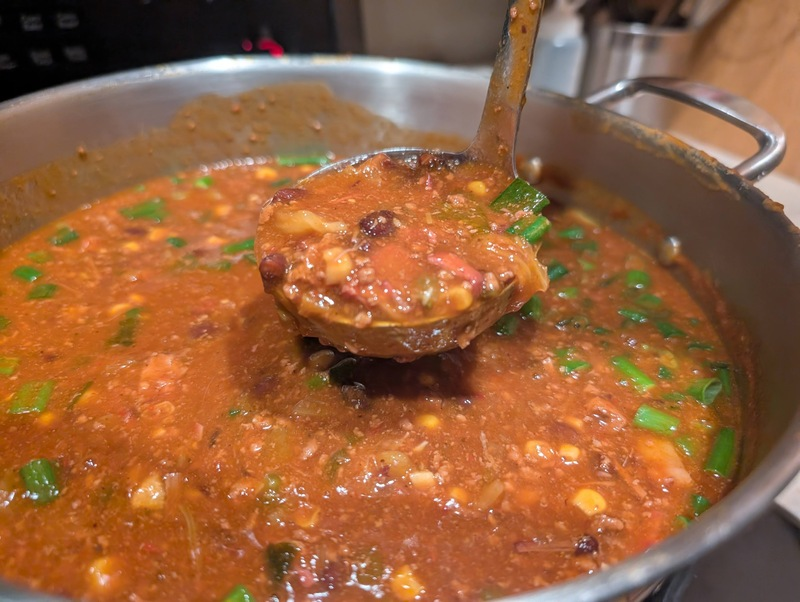

Alex's Chili is a quick and easy way to please your guests.  It only takes 5 days to prepare.  This recipe makes about 2.5 gallons of chili, which is plenty for up to 30 people.  It's also gluten free (up until the point you drown a fat piece of cornbread in the bowl).

## Materials

- chorizo (1.5-2 lbs)
- boneless beef ribs (4-4.5 lbs)[^1]
- ground beef (2-3 lbs)
- sesame oil (0.5 cup)[^2]
- white onion, diced (1)
- green bell pepper, diced (1)
- jalapeño, diced (1)
- celery, diced (1 cup)
- green onion whites, sliced (1 cup)
- green onion greens, sliced (2 cups)
- gochugaru (0.25 cups)
- gochujang (0.25 cups)
- black pepper (1 tsp)
- garlic, minced (1 head)
- kimchi (2 cups)
- canned tomatoes, blended (2 28 oz cans)
- [brown stock](./brown-stock.md) (1 gallon)
- black beans (1 30 oz can)
- sweet corn (2 cans)
- potato starch (10 tbsp)
- kosher salt (excess)

## Procedure

### Smoking the Meat

Rinse the beef ribs and pat dry.  You may optionally dust them with adobo seasoning, gochugaru, bbq rub, or any seasoning of your choice (or you can leave them plain).  Do not rinse nor season the chorizo (the Bible says it is a sin to mess with chorizo).

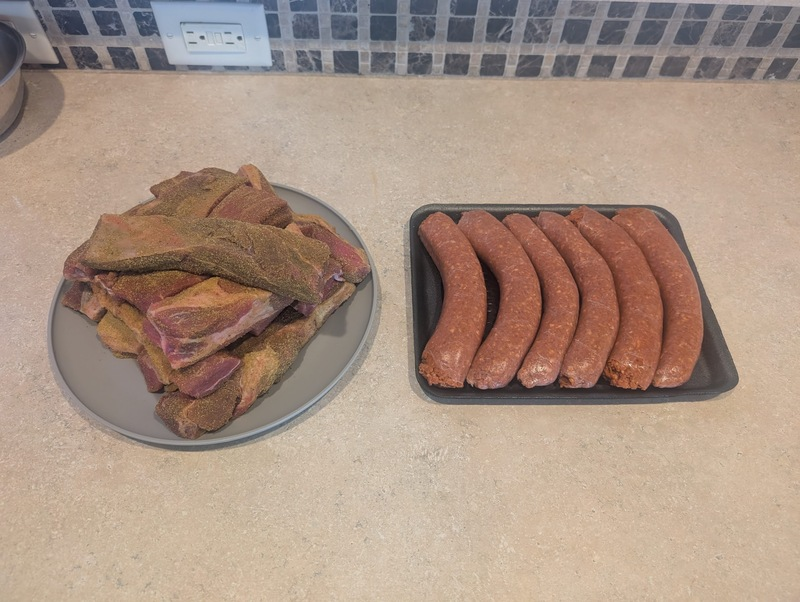

Prepare the smoker.  Once it is producing clean smoke consistently between 220-270F, add the meat.  The beef can be closer to the heat, but the chorizo should receive VIP treatment.  If possible, leave a small gap between all the pieces of meat to encourage the formation of delicious meat bark.[^3]

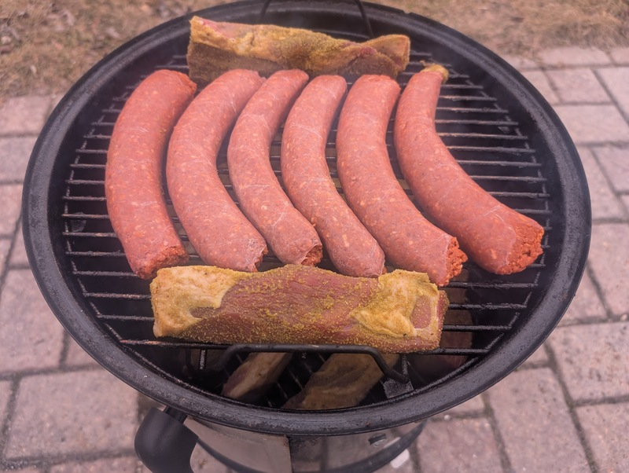

Let the meat smoke for 4 hours.

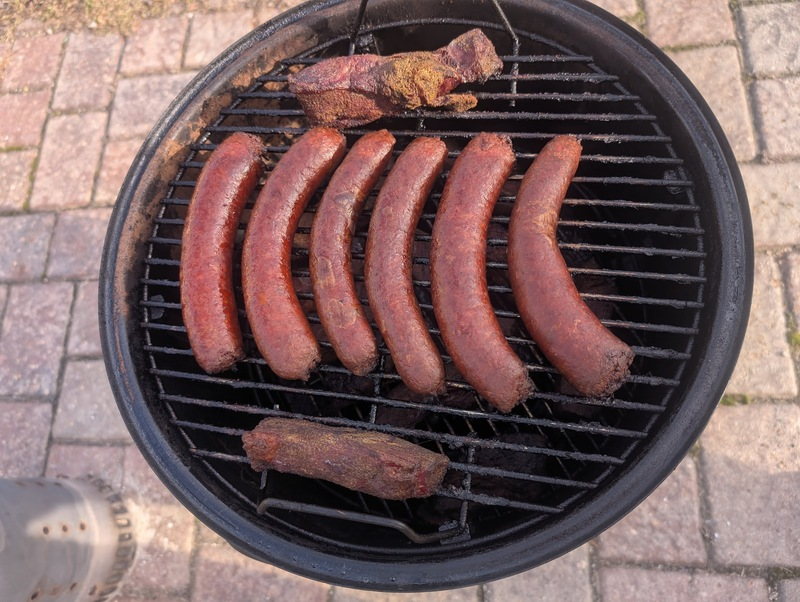

Remove meat from the smoker.  Dice up the chorizo and beef ribs and store in the fridge until the big day.

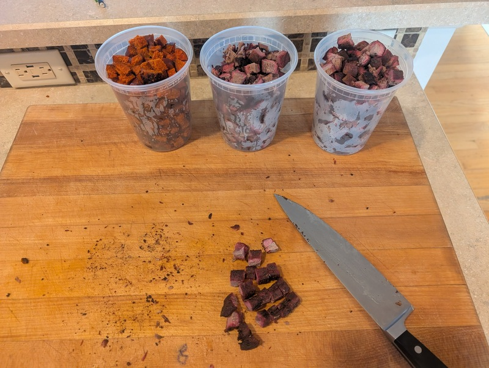

### Preparing the Ingredients

Place the white onion, celery, bell pepper, jalapeño, and green onion whites together in a large plate/bowl.  We will call this the **veggie bowl**.

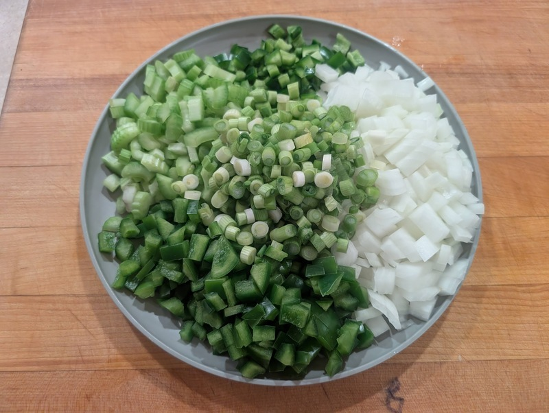

Place the gochugaru, gochujang, garlic, and pepper in a separate smaller bowl.  We will call this the **spices bowl**.

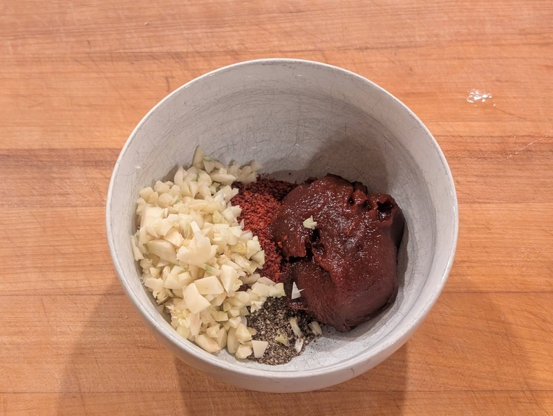

Squeeze the juice out of the kimchi into a separate container.  Chop up the kimchi into small bite sized pieces and set aside.

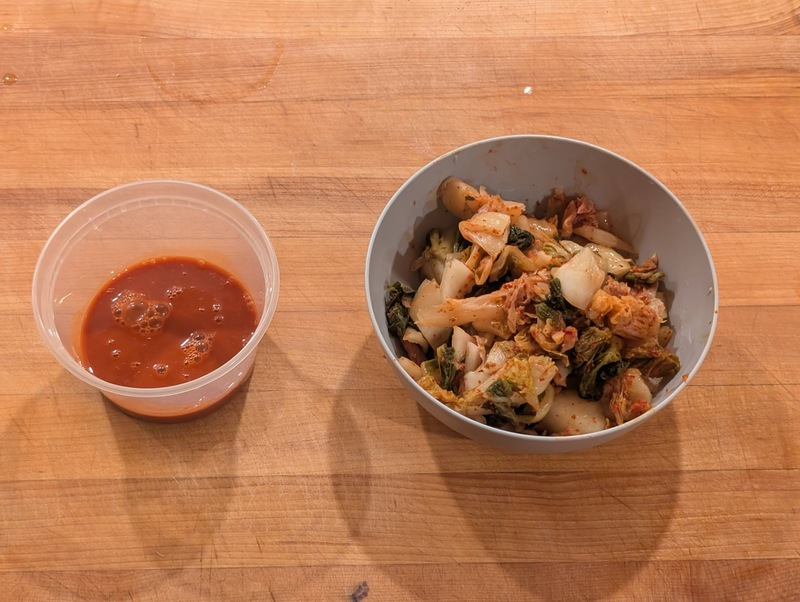

Open the cans of tomatoes and blend them until smooth (you can use an immersion blender and do this in their cans).  Open the cans of corn and drain out the water.  Open the can of black beans, but do not drain anything out.

Lastly, warm up the brown stock on the stove in a separate pot.

### Cooking the Chili

Place a large stockpot on high heat and add all the sesame oil and ground beef.  Use a wooden spoon to break up and mix the ground beef.  When the meat has turned completely brown, add all the contents of the **veggie bowl** along with a big pinch of kosher salt.

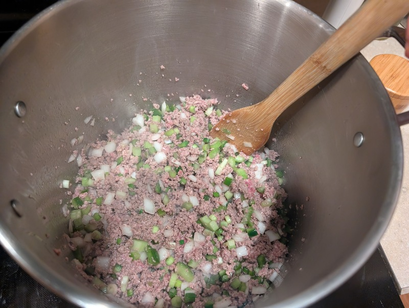

Continue to stir the mixture while heating.  You will notice a large pool of liquid gathering at the bottom of the pot.  Continue to cook until this liquid is nearly gone, or at least reduced by half.

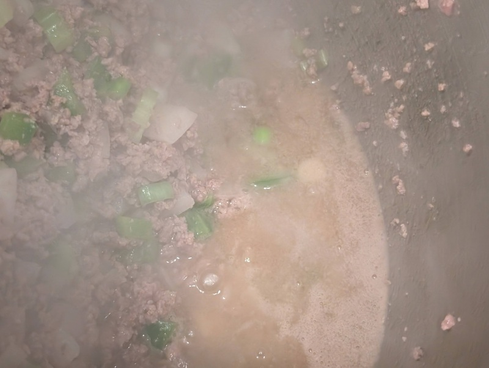

Add the contents of the **spices bowl**.  Continue to stir the mixture.  You should start to feel the mixture getting drier, and it might even start to stick to the bottom.  When this happens, dump in all the kimchi juice.

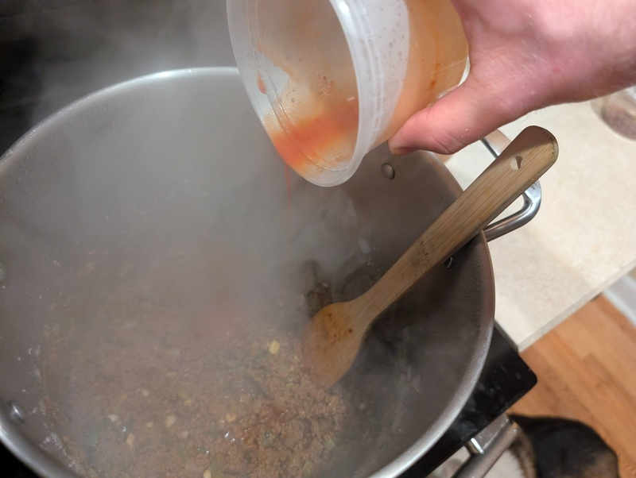

Continue to cook the mixture until nearly all the kimchi juice is gone.  Immediately add the blended tomatoes and all the beef stock.

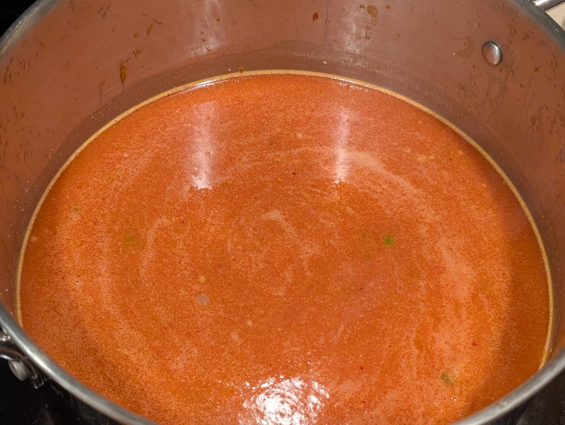

Bring the pot to a boil, then reduce the heat to a simmer.  Add the rest of the ingredients: chopped kimchi, smoked chorizo, smoked beef rib, corn, and black beans (dump in the whole can of beans, including the liquid).  Let the chili simmer for at least 2 hours.  Occasionally stir the pot to loose up clumps of meat that gather on the bottom.

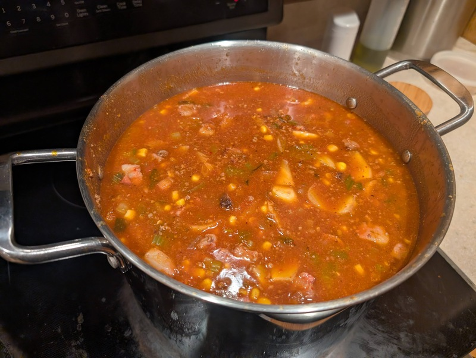

While the chili simmers, you can be a little naughty with secret ingredients.  Snoop through your pantry for tobasco, worcestershire sauce, or any other _impromptu_ ingredients you feel compelled to add.

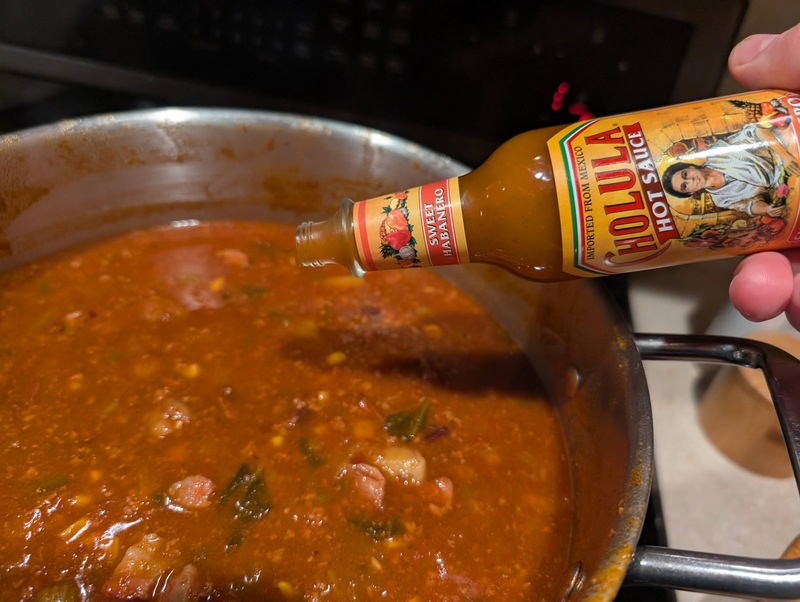

Add 10 tbsp of potato starch to a separate bowl.  Stir in just enough cold water to dissolve all the potato starch.  When all the potato starch is dissolved, add it to the pot of chili and stir to combine.  You may have to do this in batches, and you can also use more or less to achieve your desired thickness.  Once the potato starch is in, turn the heat to low (refrain from boiling from here on out).

Add salt to taste.  For this batch in the photos, I needed 19 grams of kosher salt.

Just before serving, add the green onion tops and stir.  For best results, place the chili back in the fridge and warm it up the next day.

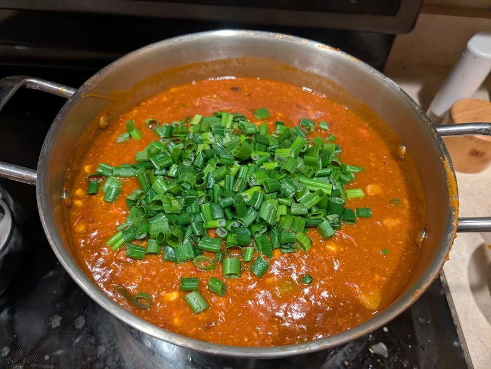

[^1]: the term "boneless beef ribs" may be misleading, the ones I get are only $3-6 per lb.  This may be the less fatty back ribs, or possibly even just a lean piece of sirloin cut into strips.  I wouldn't recommend a premium piece of meat, like actual bone-in beef ribs.  If you can't find "boneless beef ribs", I would just get a big piece of sirloin or chuck roast and cut it into 10-12 small portions.
[^2]: can substitute some or all beef fat as well, if you got any from making the brown stock
[^3]: if you get anxious about smoking meat, don't worry - this is very low stakes BBQ.  In fact this meat will likely come out very dry and underseasoned (the beef especially).  This is perfectly fine, since it's going to be dropped into the chili.  The important part of this process is that we imbue the meat with blessed smoke flavor from our holy burnt offering.
