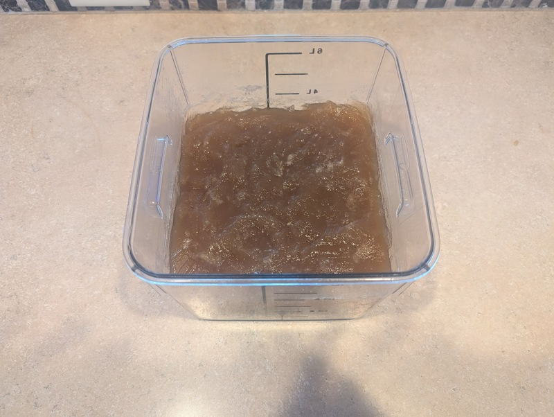
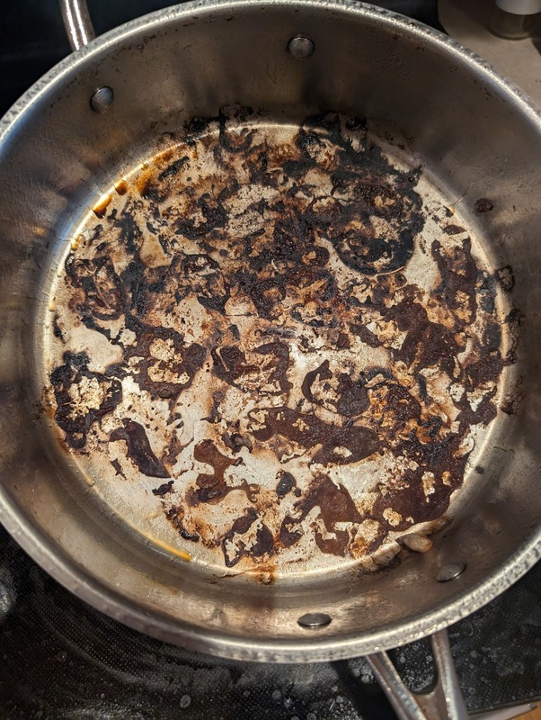
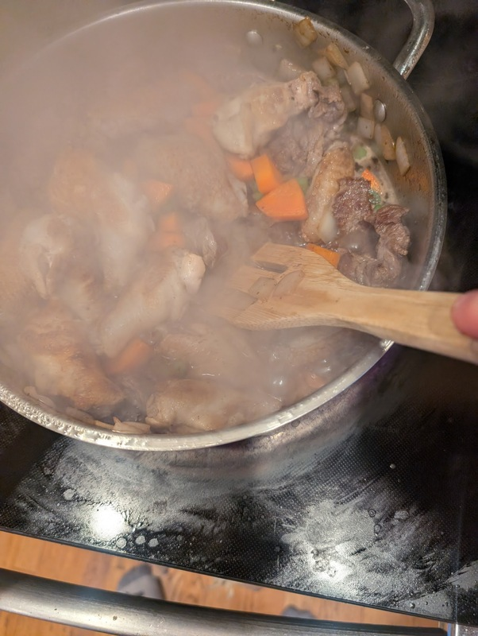
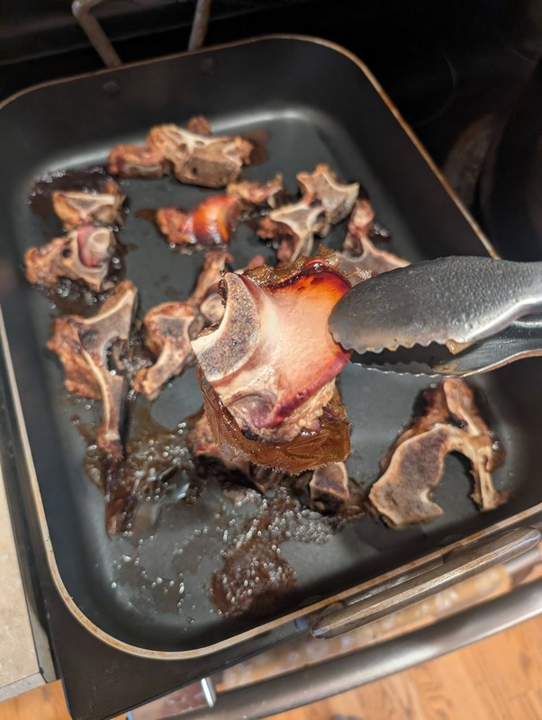
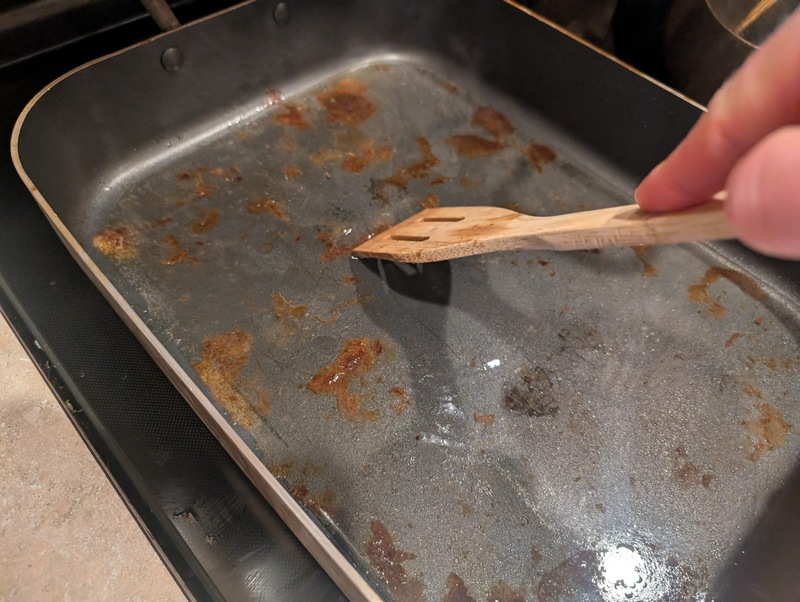
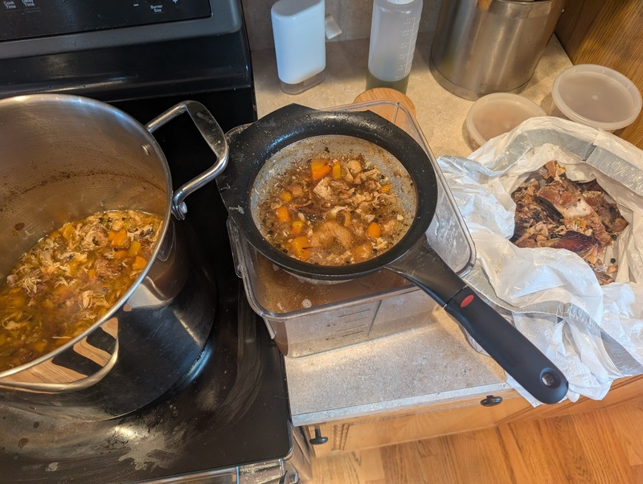
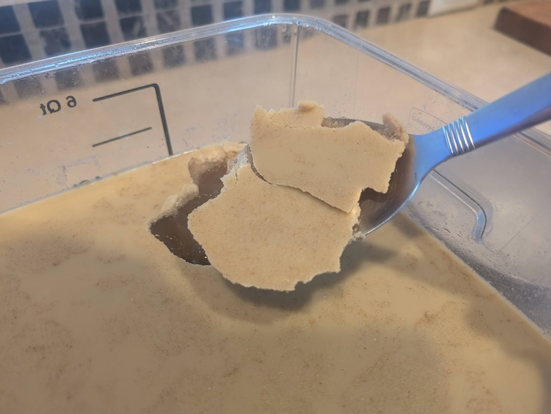

# Brown Stock

Author: Alex Recker

This recipe makes 1 gallon of unseasoned brown stock.  It can be used as a base for soups and stews, concentrated down to make sauces, or even used as a foundation to make other stocks.

Some general rules with homemade stocks:

- While making, do not boil the stock too severely.  This will result in a cloudy, bitter flavor.
- Store in the fridge for 3-4 days or in the freezer for 3 months.
- Bring to a simmer before using in recipes.  This sanitizes the stock.

## Materials

- [white stock](./white-stock.md) or water[^1] (1 gallon)
- beef neck bones (3-4 lbs)
- chicken wings, drums and flats separated  (1-2 lbs)
- white onion, roughly diced (half)
- carrot, roughly diced (1 cup)
- celery, roughly diced (1 cup)
- whole peppercorns (1 tbsp)
- bay leaf
- kosher salt (pinch)
- vegetable oil (1 tbsp)[^2]

## Procedure

Add the cold white stock to a large stock pot.  Set aside, leaving at a light simmer.

Use a boning knife to carve pieces of meat from the beef neck bones.  Rinse the bones and the meat in a bowl of cold water and pat dry.  Set aside the meat and place the beef neck bones in a roasting dish or stainless steel pan in a cold oven.  Turn the heat to 400F (with convection if available) and roast for 1-2 hours.

Rinse the chicken wings in a bowl of cold water.  Pat them dry and set them aside.

Place a separate stainless steel pain on medium high heat and add vegetable oil.  When the oil is at searing temperature, add all the chicken wings to the pan.  If you cannot fit all the chicken wings, it is fine to do them in batches.

Sear until they are well-browned on one side.  Use tongs to carefully flip them and sear the other side.

Remove the chicken wings from the pan.  With the heat still at medium high, add all the beef pieces to the pan, arranging them evenly.  Sear the meat until it is well browned on both sides.

Turn off the heat, then remove all the meat and set aside.  At this point, you should have a generous coating of brown (not burnt) _frond_ stuck to the bottom of the pan.

Have a pitcher of cold water nearby.  Place the _frond_ pan back on the stove at its highest heat setting.  Once you start to see faint smoke, dump all the carrots, celery, and onion into the pan.  Swirl the pan to "wake them up" without burning them for 1 minute.

Dump the chicken wings and beef meat back into the pan and continue to swirl.  Let the heat come back, then dump in a splash of cold water.  Use a wooden spoon to detach the _frond_ from the bottom of the pan.

Turn off the heat, then transfer everything into the larger stockpot where the white stock is simmering.  The searing pan should be pretty much clean, but if there is more _frond_ left over, you can place it back on the heat and use more cold water to detach it.

After the bones have roasted for 1-2 hours, take them out of the oven.  Use tongs to remove the bones from the dish and add them into the stockpot.  If there is any fat in the roasting dish, pour it into a separate container and reserve if desired.[^3]

While the roasting dish is still hot, add a splash of cold water.  Use a wooden spoon to scrape off the bottom.  Transfer the liquid from the roasting dish to the stock pot.

Simmer the stock for 4-5 hours.  Top it off with cold water throughout the time as needed.  You will know it's finished when the meat is practically liquefied.  Use tongs to remove the larger pieces of bone and discard.  Strain the stock into a large container and discard the meat, bones, and vegetables.  If your volume is less than a gallon, top the container off with cold water.

Place the stock in the fridge overnight.  In the morning, use a spoon to remove the solid layer of fat as well as any blotches of cloudy scum that have formed under the surface.

[^1]: starting with white stock is recommended for a richer base, but if you are short on time you can make a simpler "short stock" based on water
[^2]: any neutral oil works fine
[^3]: the resulting beef tallow from this process makes a delicious replacement to any high smoke point oil, but I've found it doesn't always render out of neck bones
