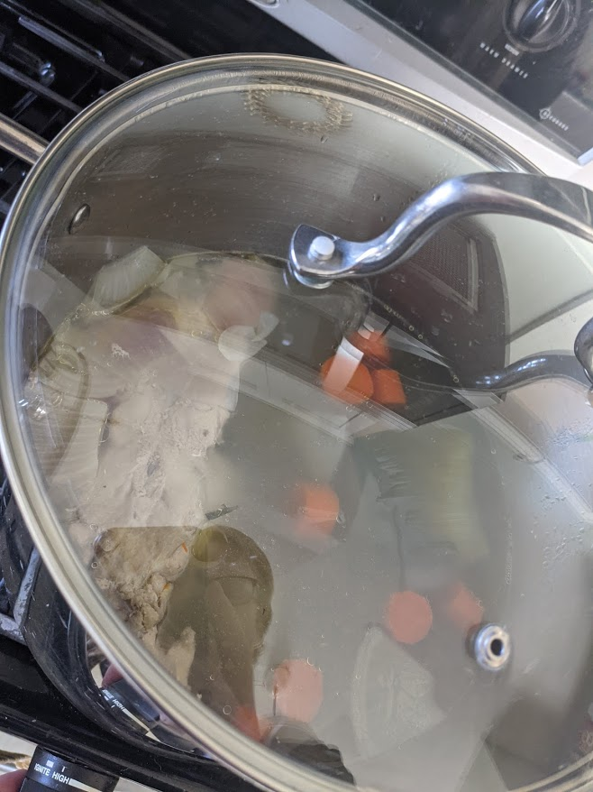
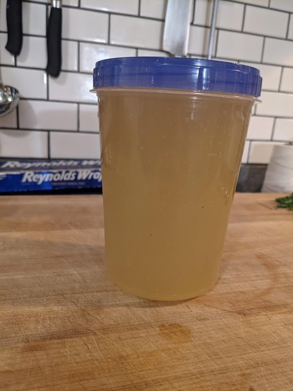

# Chicken Stock

Author: Alex Recker

Why should you make your own chicken stock?

1. It's easy.
2. It tastes better than the stuff out of the box.
3. You can make it from stuff you would normally throw out.

You can keep everything in the freezer until it's time to use.  Even
if a vegetable is old and wilted, it will still make great stock.

## Materials

**Required:**

- chicken carcass[^1]
- cold water

**Suggested:**

- carrots
- onions
- celery
- leeks
- green onions
- shallots
- parsley stems
- herbs
- parmesan rind

## Procedure

1. Remove skin, loose fat, and tail from chicken carcass.  Add to a clean stock pot.  Add cold water until the carcass is just covered.

2. Raise the heat to a boil.  As the temperature rises, scum should collect on the surface.  Remove it with a wide spoon.

3. As the pot comes to a boil, add another quart of cold water.  Wait for the pot to come to temperature again and once again spoon off the scum.

4. Add vegetables.  Wait for pot to come to a boil.  Cover and simmer for 2-3 hours.

5. Turn off heat.  Strain stock and funnel into a clean container.  Keeps in the fridge for 3-5 days.

[^1]: can also use other raw bones
