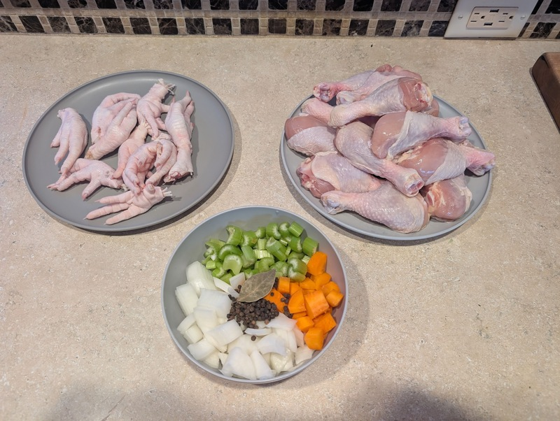
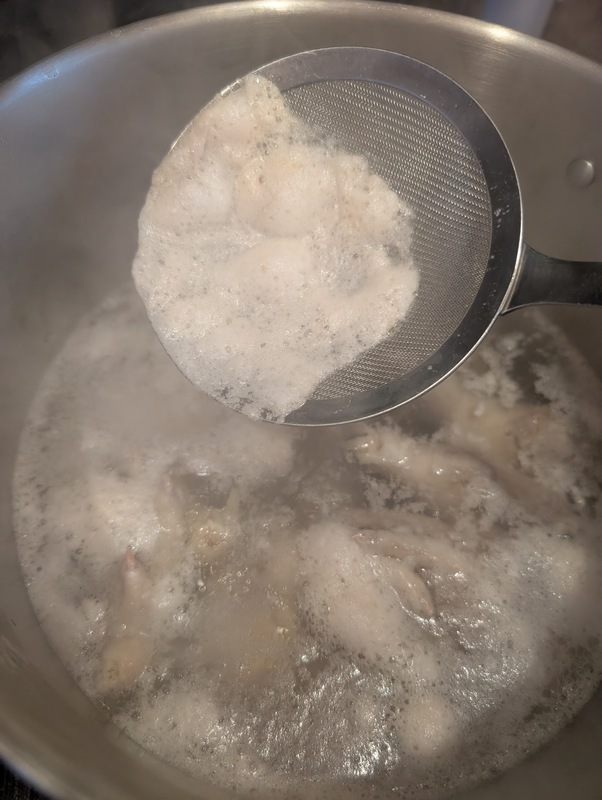
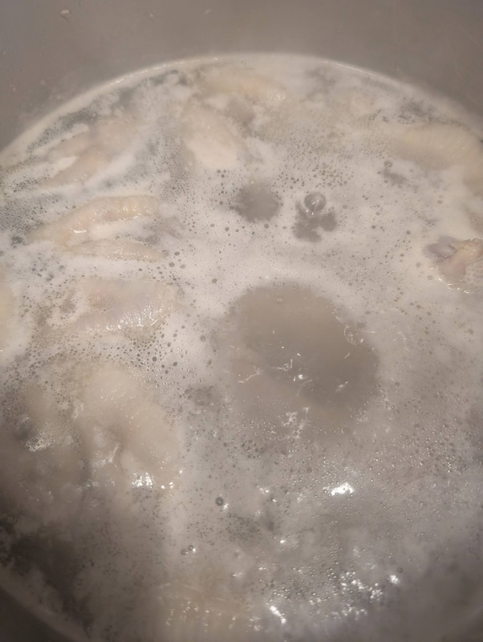
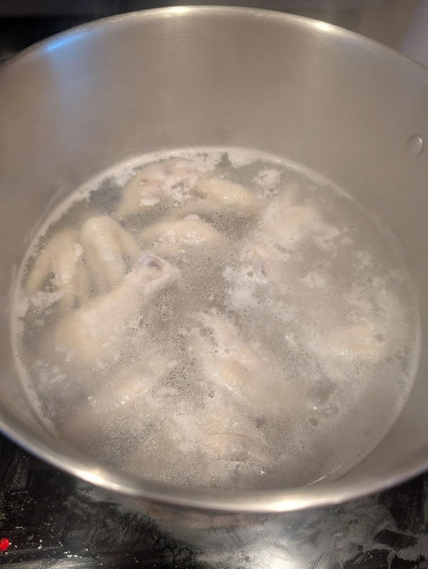
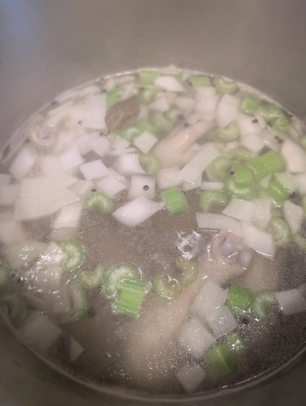

# White Stock

This recipe makes 1 gallon of unseasoned white stock.  It can be used as a base for soups and stews, concentrated down to make sauces, or even used as a foundation to make other stocks.

Some general rules with homemade stocks:

- While making, do not boil the stock too severely.  This will result in a cloudy, bitter flavor.
- Store in the fridge for 3-4 days or in the freezer for 3 months.
- Bring to a simmer before using in recipes.  This sanitizes the stock.

## Materials

- chicken feet (1 lb or 1 pack)
- chicken parts (3-4 lbs)[^1]
- kosher salt (pinch)
- white onion, roughly diced (half)
- carrot, roughly diced (1 cup)
- celery, roughly diced (1 cup)
- whole peppercorns (1 tbsp)
- bay leaf

[^1]: Suggested "parts": thighs, wings, breasts, cages, backs, meaty scraps

## Procedure

Rinse chicken feet and parts in a bowl under very cold water.  Pat dry and them to the bottom of a large stockpot.

Fill the stockpot with enough cold water to generously cover the chicken feet and parts.[^2]

Place the stockpot on the highest heat setting and add a pinch of kosher salt.  Let the pot come to a boil.  Be ready with a pitcher of cold water and a fine mesh spider.

As the pot comes to a poil, little tan puffs of foam will appear on the surface.  Use the fine mesh spider to scoop this foam from the surface and discard.

When the foam is removed, add a splash of cold water to stop the boiling.  Gently move the meat around with the spider, then let the pot come back to a boil.  The foam should appear thinner and whiter.  Use the spider to scoop the foam from the surface and discard.

Repeat the last step until the foam on the surface basically disappears.

Add a splash of cold water to stop the boiling, then add the onions, carrots, celery, peppercorns, and bay leaf.

Set the heat to medium-low.  Let the mixture simmer for 3-4 hours until the meat is falling off the bone.

[^2]: If you see lots of blood in the water, it would be a good idea to dump out the water and rinse again.  Blood will change the color of the stock and introduce a bitter flavor
