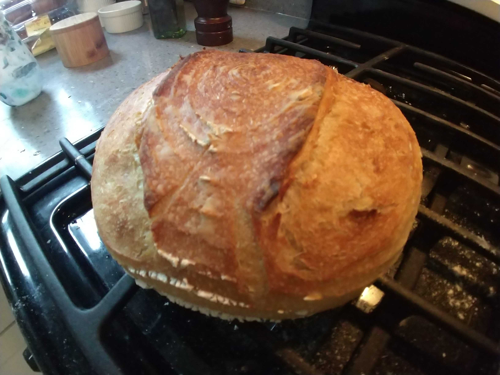

# Sourdough

## Materials

- sourdough starter (0.25 cup)
- water, cold (1 cup)
- salt, kosher (1.5 tsp)
- flour, all purpose (2.5 cups)

## Procedure

1. Add sourdough starter and water to a mixing bowl.  Use the water to
   rinse the measuring cup clean to ensure you get all the starter in
   the bowl.

2. Add salt and flour all at once.

3. Using a mixer, mix with a dough hook on low until the dough comes
   together.  It should be sticky enough to pull the dough off the
   sides of the bowl.

4. Cover the bowl with a towel or tinfoil and set aside for four
   hours.  During this time, pull and fold the dough over itself about
   ten times once every hour.

5. Scoop the dough onto a clean table.  Sprinkle the top of the dough
   ball with flour.  Using a circular motion from the bottom, pinch
   and spin the dough into a tight ball.

6. Move dough ball to a wooden banneton and cover.  Allow dough to
   rise at room temperature for ten hours, or until it passes "the
   poke test".  If you poke the dough, it should be soft, and even
   though it should slowly spring back to the touch, an imprint should
   be left from your finger.

7. Transfer from the banneton to a square of parchment paper.  Score
   the dough and lower into a cold dutch oven.

8. Mist with water, then bake the dough covered in a cold dutch oven
   at 450 F for 20 minutes.

9. Remove the lid and bake for an additional 25 minutes.

10. Remove from the oven and transfer to a rack.  Allow the loaf to
	cool completely before cutting.
