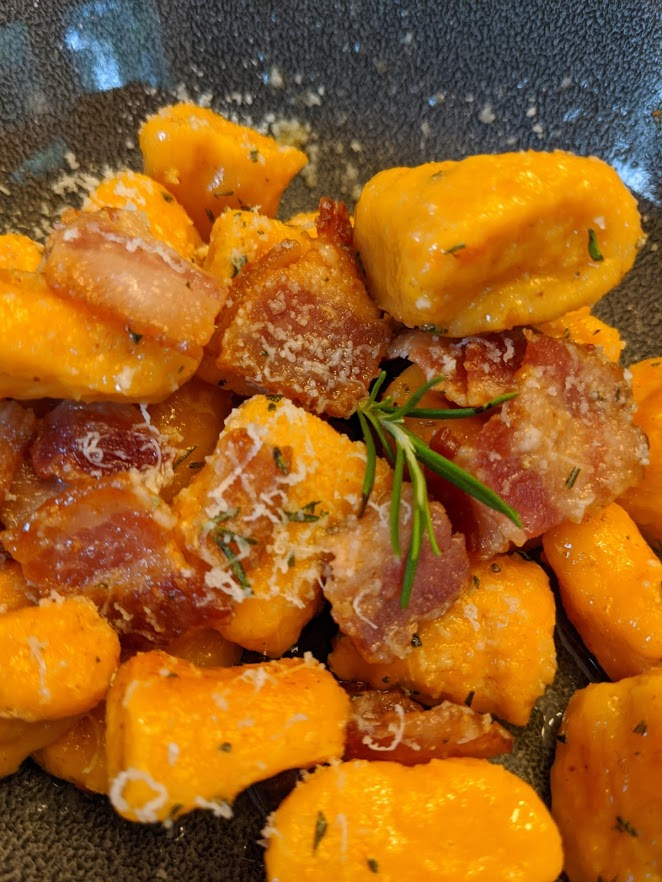

# Sweet Potato Gnocchi

## Materials

- sweet potato (1 large or 2 small)
- egg (1)
- ricotta (0.25 cup)
- salt
- pepper
- flour (~ 1.5 cup)

## Procedure

1. Use a knife to pierce the skin of the sweet potato all over.
   Microwave on a plate until tender and a knife pierces easily.

2. When the potato is cool enough to handle (but still warm), cut in
   half and scrape out the orange flesh into a large bowl.  Thoroughly
   mash the flesh in the bowl with a potato masher.

3. Add ricotta, salt, and pepper.  Mix thoroughly, then add one beaten
   egg and mix again.

4. Slowly start to incorporate flour, stirring at first, then using
   your hands to gently fluff the mixture into a doughball.  Add flour
   until the dough is workable.

5. Portion the dough into four pieces.  Using your palm, thumbs, and
   pads of your fingers, gently roll each portion into long snakes,
   then cut them into small pillows using a floured bench scraper.

6. Set aside gnocchi on a floured pan to dry out, or leave them in the
   fridge.

7. Bring a large pot of well salted water to a boil.  Add a drizzle of
   olive oil to the pot.

8. Give the water a stir, then dump in all the gnocchi at once.  Keep
   the water moving to ensure they don't stick.

9.  After a about two minutes (depending on how big you cut them), the
    gnocchi should float to the top of the water.  Fish them out about
    ten seconds later with a spider, and transfer them to either some
    warm broth or finish them in a pan with brown butter.  Feel free
    to let the pasta water spill onto the plate, as it adds flavor.

## References

- [Food Wishes: Sweet Potato Gnocchi with Bacon Butter](https://www.youtube.com/watch?v=q9k5A-Ahpgc)
