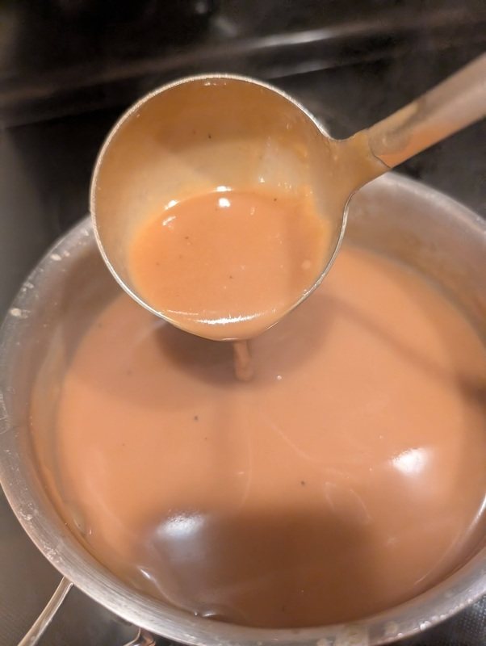

# Gravy

Author: Alex Recker

A French veloute sauce repurposed into a classic Thanksgiving gravy.  This recipe makes a half gallon - plenty for 10-20 people.  You can use any kind of stock, but for best results use your finest [turkey stock](./turkey-stock.md) or [turkey jous](./turkey-jous.md)

## Materials

- all purpose flour (3 oz weight)
- turkey fat + butter, mixed (3 oz weight)[^1]
- [turkey stock](./turkey-stock.md) or [turkey jous](./turkey-jous.md) (2 quarts)
- salt
- pepper (use white pepper if you don't want black specks in the final sauce)

[^1]: The ratio of turkey fat to butter is a personal preference.  You can also use all butter if you don't want to bother with it.

## Procedure

1. Dump out the flour evenly on to a small baking sheet on a piece of parchment paper.  Place the flour underneath the broiler on HIGH for at least 5 minutes or until the flour turns lightly brown (don't walk away from it, it's really easy to burn).  Take the flour out of the oven and set aside.

2. Dump all the butter + turkey fat into a small sauce pan on high heat.  When the butter begins to chant, turn the head down to medium and add all the flour.

3. Whisk the flour and fat together as the mixture gently heats.  Keep the mixture moving constantly, adjusting the heat as needed to maintain a constant bubbling.  Remember to whisk the corners of the pan to keep the roux from burning.

4. After five minutes or when the roux smells like a freshly baked cake, take the pan off the heat and allow to completely cool.

5. Warm up the stock in the microwave or in another sauce pan.  Place the roux back on medium heat and add a cup of stuck.  Whisk until thoroughly combined.

6. Continue to add stock as you whisk and heat the gravy.  When all the stock is added, let the gravy come to a simmer.

7. Adjust the thickness to your preference.  To thin it out, add water or stock.  To thicken it, whisk in wondra or a _Beurre Manié_ (best to do this with a portion of the stock scooped into a separate bowl so you don't risk introducing clumps to the whole thing).

8. Add salt and pepper to taste.  If you plan on adding turkey drippings, it's best to leave it slightly under-salted.

9. For best results, allow the gravy to cool and place in the fridge overnight.  On the big day, warm up the gravy on the stove.  Add a handful of freshly chopped herbs and serve.
