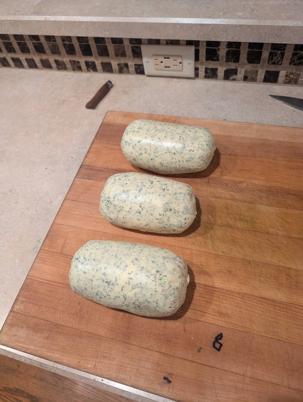
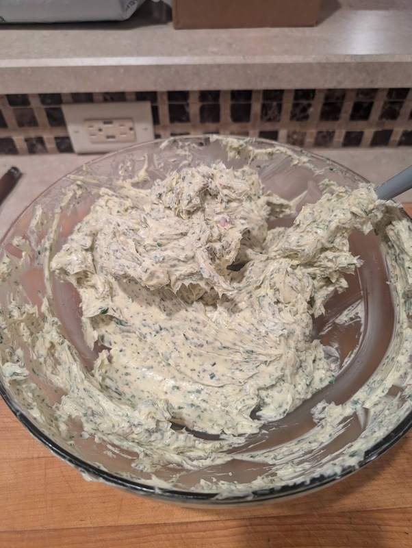

# Herb Butter

Author: Alex Recker

This "Herb Butter" recipe is basically a French style compound butter using traditional Thanksgiving poultry herbs.  You can use in any recipe that calls for butter and it will elevate your dishes.  The quantities are _very_ flexible - after all, you are just trying to enhance regular old butter with some extra flavors.

This only works with very soft butter.  Leave it on the counter for at least a day before attempting this.

## Materials

- butter, unsalted & room temperature (as much as you need)
- fresh thyme (1 pack)
- fresh sage (1 pack)
- fresh rosemary (1 pack)
- fresh parsley (1 bunch)
- shallots (1)
- neutral oil (1 tbsp)
- lemon (1)
- salt, kosher (to taste)
- pepper (to taste)
- cling wrap

## Procedure

1. Add warm butter to a big mixing bowl.  Smash it together with a rubber spatula and set aside.
2. Pick the leaves off the fresh thyme, sage, rosemary, and parsley.  Use a knife to chop it all up into very fine pieces and add it to the bowl of butter.
3. Mince a shallot and add it to the bowl of butter.
4. Clean your lemon.  Remove the zest, then mince the zest with a knife and add it to the bowl.
5. Add your neutral oil and the juice from your lemon to the bowl of butter.  Mix it all together with your spatula.  It may take time, but eventually the butter will be evenly speckled with your herbs and the lemon juice & oil will disappear into the mix as well.
6. Add pepper and salt.  This sounds weird, but give it a taste to see if there is enough salt (the salt helps draw out the flavors).
7. Portion the butter out onto pieces of cling wrap.  Roll the butter into logs.  Pinch the excess cling wrap together on the sides and twirl, forming a tight sausage like roll.
8. Let it rest in the fridge overnight.  You can either freeze it or leave it in the fridge.

