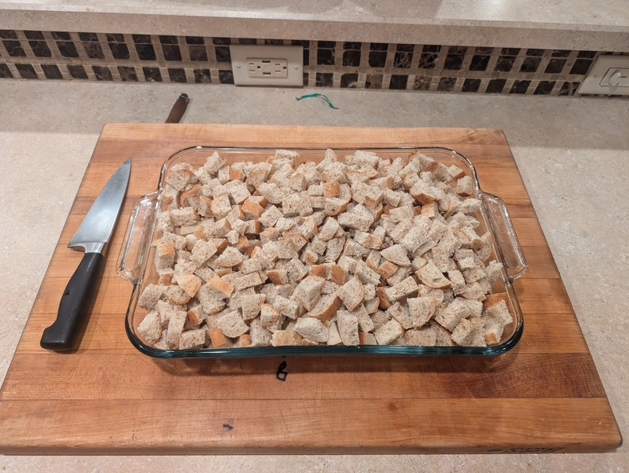
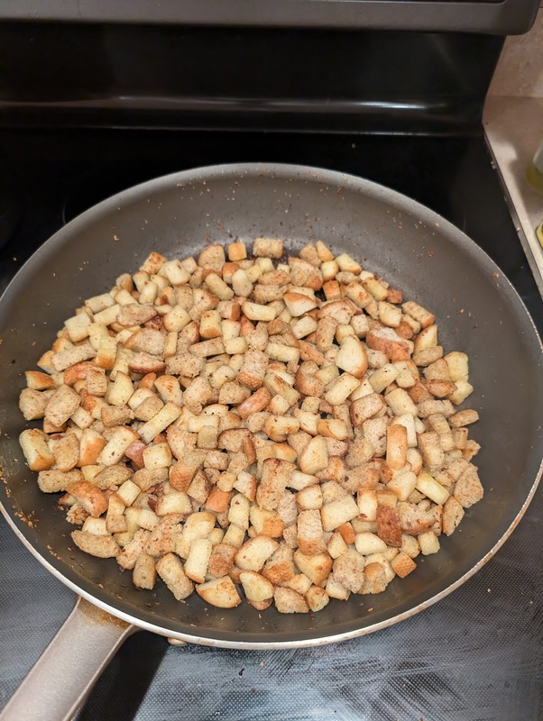

# Stuffing

Author: Alex Recker

## Materials

- pyrex baking dish, 11x15in
- white and wheat bread, slightly stale, cut into "communion sized" chunks (enough to fill the dish)
- olive oil (a lot)

**Notes**

This recipe yields an 11x15in dish of stuffing.  The best way to measure how much bread you need is to just cut it up and fill the pan you plan to bake it in.  The bread chunks should mound well over the top without spilling over (the bread chunks will shrink as you cook them).

## Procesure

### Make the Croutons

1. Fill a large, non stick pan with bread chunks.  Add olive oil until the chunks are mostly coated.
2. Place the pan on high heat.  Once they begin to fry, use a wooden spoon to toss, stir, and flip the croutons constantly.
3. Step down the heat if they begin to burn.
4. Fry the croutons until they are crispy and well-colored on the outside, but still chewy on the inside.
5. Set the croutons aside in a large mixing bowl

**Notes**

This step takes a while, but the croutons will keep well in a sealed container at room temperature.  So it's a good idea to fry them in batches throughout the week.  When I am making double batches, I just add all the croutons to a clean 5 gallon bucket and cover it in tinfoil.
