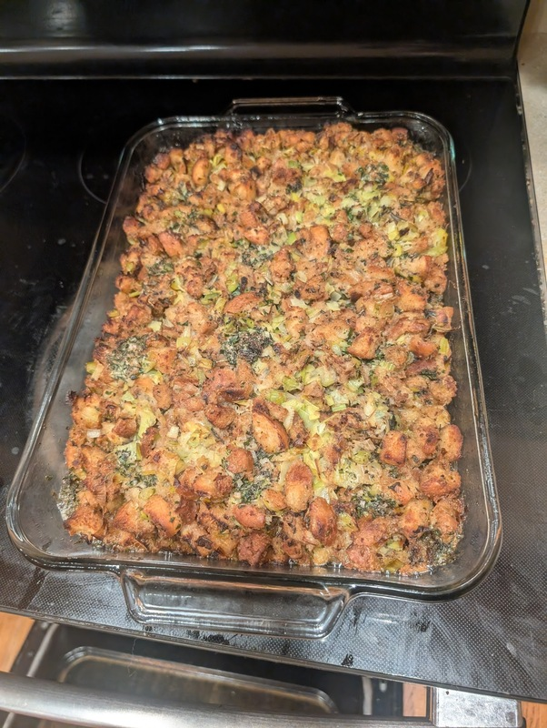

# Stuffing

Author: Alex Recker

A classic Thanksgiving stuffing.  Best to prepare the day before Thanksgiving so you can bake it right before the big meal.

## Materials

- pyrex baking dish, 11x15in
- white and wheat bread, slightly stale, cut into "communion sized" chunks (enough to fill the dish)
- olive oil (a lot)
- thyme, picked (1 pack)
- rosemary, picked (1 pack)
- sage, picked (1 pack)
- parsley, picked (1 cup)
- leeks, sliced (4)
- celery, chopped (1 cup)
- brandy (1 shot)
- [turkey stock](./turkey-stock.md) (1 quart)
- salt
- pepper
- [herb butter](./herb-butter.md) or butter, softened (0.5 cup)

**Notes**

This recipe yields an 11x15in dish of stuffing.  The best way to measure how much bread you need is to just cut it up and fill the pan you plan to bake it in.  The bread chunks should mound well over the top without spilling over (the bread chunks will shrink as you cook them).

## Procesure

### Make the Croutons

1. Fill a large, non stick pan with bread chunks.  Add olive oil until the chunks are mostly coated.
2. Place the pan on high heat.  Once they begin to fry, use a wooden spoon to toss, stir, and flip the croutons constantly.
3. Step down the heat if they begin to burn.
4. Fry the croutons until they are crispy and well-colored on the outside, but still chewy on the inside.
5. Set the croutons aside in a large mixing bowl
6. Mix all the thyme, sage, rosemary, and parsley together.  Finely chop it and add it to the mixing bowl.

**Notes**

This step takes a while, but the croutons will keep well in a sealed container at room temperature.  So it's a good idea to fry them in batches throughout the week.  When I am making double batches, I just add all the croutons to a clean 5 gallon bucket and cover it in tinfoil.

### Make the Filling

1. Add a big notch of butter and a glug of olive oil to a large dutch oven and place over medium high heat.

2. When the butter starts to chant, add all the sliced leaks.  Add a big pinch of salt.  Cook them down for 5 minutes (let them sweat, but don't fry).

3. Add the celery.  Continue to cook the mixture for another 5 minutes.

4. Turn the heat to high and add the shot of brandy.  Stir well and let the brandy evaporate.  Turn off the heat and set the aside to cool.

### Assemble the Tray

1. Dump the cooked down vegetables into the mixing bowl with the croutons.  Toss until the mixture looks even.

2. Warm up a quart of turkey stock.  Dump it into the mixing bowl.

3. Add salt and pepper to taste (you will need a lot of salt)

4. Wipe the bottom and sides of the pyrex dish with herb butter.

5. Dump the mixing bowl into the dish.  Spread evenly and gently tamp it down, but don't smash it.

6. Arrange little knobs of herb butter on top of the stuffing over the whole tray.  Place some in the corners too.

7. Cover the dish tightly in foil and place in the fridge overnight.

### Baking the Stuffing

1. Pre-heat the oven to 400F and turn on convection.

2. Place cold pyrex dish in the oven, leaving the foil on top.  Bake for 40 minutes.

3. Remove foil.  Bake for an additional 20 minutes.

4. Remove the dish and let cool.
