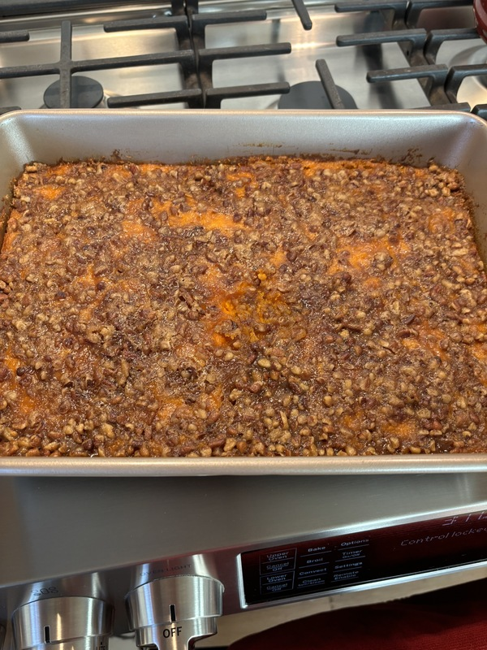

# Sweet Potato Casserole

Author: Jane Recker

The family classic.  Make as much as you want, but Jeremy is going to eat it all.  Makes a 9x13 baking pan.

## Materials

- sweet potatoes, large (6)
- salt (0.25 tsp)
- butter, softened (0.25 cup)
- butter, hard (0.25 cup)
- eggs (2)
- vanilla extract (1 tsp)
- ground cinnamon (0.5 tsp)
- white sugar (0.25 cup)
- half and half (2 tbsp)
- flour (3 tbsp)
- light brown sugar, packed (0.75 cup)
- pecans, chopped (0.5 cup)

## Procedure

1. Preheat oven to 350F.  Lightly grease 9 x 13 baking pan.

2. Bake sweet potatoes till soft.  Timing varies based on size of potatoes.  Cool briefly and remove skin.

3. In large mixing bowl, mash potatoes while hot.  Add salt, hard butter, eggs, vanilla extract, cinnamon, sugar, and half and half.

4. Mix to combine.  Transfer to baking dish.

5. In medium bowl, combine softened butter, flour, brown sugar and chopped pecans.  Sprinkle over sweet potato mixture.

6. Bake 30 min covered in foil.  Uncover and brown topping.
