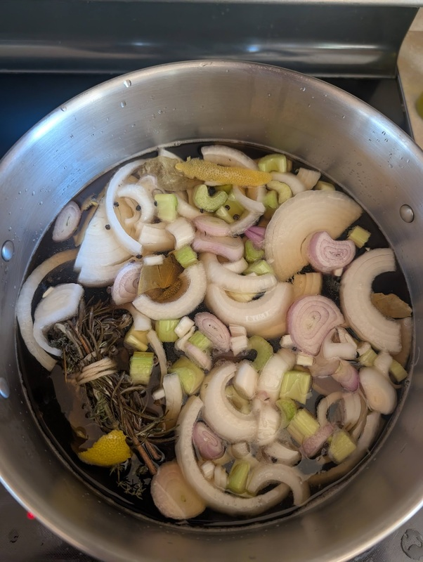

# Turkey Brine

Author: Alex Recker

Giving your turkey a brine soak before cooking makes for a juicier, more flavorful bird.  It's easy to do, and doesn't interfere with defrosting.

## Defrosting

Start with a frozen turkey.  Buy the bird **one week before Thanksgiving dinner and place it in the fridge**.  This will give it plenty of time to defrost (1 day per 4lbs plus an extra day, so a 17lb bird calls for 4.6 + 1 = 5.6 days).  Generally, even a fully defrosted bird will be fine in the fridge for 3-4 days.

## Materials

The core of the brine is the water, salt, and sugar.  Follow these rations closely, or you could risk having a bird that is too salty/sweet.

- 5 gallon paint bucket with lid (can get from Home Depot)
- cold water (2 gallons)
- ice (0.5 gallon)
- salt, kosher (4 cups)
- brown sugar (2 cups)
- parchment paper

With additional flavoring agents, the rest is up to you.  You really can't go wrong - feel free to throw in any additional flavors.

- lemon peels
- peppercorns (0.5 cup)
- herbs, fresh or dried
- bay leaves (4-5 leaves)
- shallots, chopped
- celery, chopped
- onions, chopped
- garlic (1 head)

## Procedure

1. Add 2 gallons of cold water to a giant stock pot and put the heat on high.
2. Add all the salt and brown sugar.
3. Add additional flavoring agents (ex. onions, shallots, lemon peels)
4. Use a large wooden spoon to stir.  Check the bottom to make sure the sugar and salt has dissolved (it should disappear into the solution as the temperature rises).
5. Once the liquid comes to a simmer, **shut off the heat**.  Pour the entire contents into a clean bucket.
6. Add either cold water or ice to the bucket until it is half filled.  Place in the fridge until it is completely cooled (never place a raw turkey into warm brine).
7. Unwrap the turkey.  Lower the turkey into the liquid.  Top off with cold water if needed.
8. Place a sheet of parchment paper over the top, then seal the bucket with the lid.  Place in the fridge.
9. Leave the turkey in the brine for 12-24 hours.  Remove the turkey from the liquid and thoroughly rinse the bird under cold water to wash the brine away, then pat dry with an old beach towel.  Your turkey is now ready for the big show.
