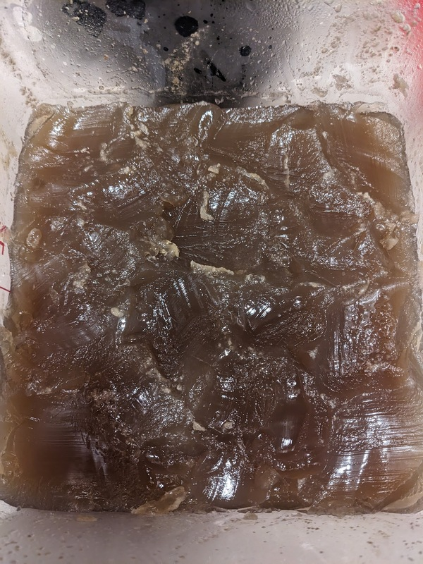

# Turkey Stock

Author: Alex Recker

This recipe yields about 1 gallon of stock.  It is made in two stages:

1. **White Stock** - gently simmering meat and vegetables together to form a clearish yellow colored stock
2. **Brown Stock** - simmering roasted and seared meat in the white stock to form a rich brown colored stock

General rules for making good stock:

- Do not over-boil the stock at any point.  This will encourage impurities to break down and infiltrate your flavor profile.
- Do not let stock sit in the fridge for longer than 3-4 days.  Instead, re-freeze and thaw as needed.
- Always bring stock to a simmer before using in food and consuming.
- If possible, concentrate your stock down to the exact quantity you need in your recipe and add salt just before serving.

## Materials

- water, cold (excess)
- kosher salt (excess)
- turkey neck pieces, defrosted (7-8)
- turkey wings, full sized, defrosted (4)
- carrots, full sized (2)
- celery (4 sticks)
- onion (1)
- peppercorns, whole (2 tbsp)
- canola oil, or any high smoke point neutral oil (1 tbsp)

## Procedure

### Make the White Stock

1. Rinse and pat try 4 turkey necks and 2 turkey wings.  Use a knife to separate the turkey wings into drums, flats, and tips.

2. Add the necks and wing pieces into a big stock pot.  Add a tiny pinch of salt.  Cover with cold water and gently bring to a simmer.

3. Use a spider, ladle, or a wide spoon to skim off the foamy, off colored scum from the top.

4. Top off with cold water, then let come to a boil again.  Skim the scum again as before.  Repeat the process of adding cold water, letting come to a boil, and skimming the scum as needed until a layer of scum does not form.

5. Roughly chop 2 celery sticks, 1 full sized carrot, and 0.5 onions and add to the stock.  Add 1 tbsp of whole peppercorns.

6. Gently simmer the stock for 3-4 hours (or until the meat is falling off the bone).

7. Turn off the heat and allow to cool.  Use tongs to remove large pieces from the stock and discard.  Strain the stock into a clean container and refrigerate over night.

8. The next day, use a wide spoon to skim and remove the waxy layer of fat that settled on the top.  Move the remaining stock into clean containers and freeze until next use.

### Make the Brown Stock

1. Rinse and pat try 4 turkey necks and 2 turkey wings.  Use a knife to separate the turkey wings into drums, flats, and tips.

2. Place the turkey wing drums and flats to a roasting dish or stainless steel pan.  Place the pan in a cold oven.  Pre-heat the oven to 400F.  Roast the turkey wings for ~2hrs or until the meat is dark colored.

3. Roughly chop 2 celery sticks, 1 full sized carrot, and 0.5 onions.  Set aside.  Add 1 tbsp of peppercorns.

4. Place a separate stockpot over medium-high heat.   Add canola oil to the pan and swirl.  Test the temperature of the oil by touching a turkey neck to the surface - if it begins to sizzle, add all the turkey necks and turkey wing tips in the oil.  Sear both sides of the meat in the bottom of the stockpot.  Move the pan around the heat and manage the stove temperature to avoid burning.

5. Remove seared meat and set aside.  Add chopped onions, carrots, and celery.  Swirl in the pan for 1-2 minutes, but do not fry the vegetables.

6. Turn the heat on HIGH and add seared meat and accumulated juices.  Add a splash of cold water and deglaze, scraping the bottom of the stockpot to detach brown bits.  Add all the white stock from the previous step and slowly bring to a simmer.

7. When the wings have finished roasting, remove the pan and carefully place the roasted wings into the stockpot.

8. Pour off the turkey fat in a separate bowl and set aside.  Place the empty pan on a stove at high heat.  When it starts to smoke, add a splash of water.  Deglaze, scraping the pan with a wooden spoon.  Dump the accumulated colored water and brown bits into the stockpot.  Repeat as needed with small portions of water until the pan is clean.

9. Gently simmer the stock for 3-4 hours (or until the meat is falling off the bone).

10. Turn off the heat and allow to cool.  Use tongs to remove large pieces of bone and discard.  Pour the rest through a pasta strainer and discard pieces.

11. Perform one final filtration to collect fine particles and grit.  Line a mesh strainer with a wet paper towel.  Use a ladel to scoop portions of the stock into the strainer.  If stock stops running through the filter, then it's probably clogged with scum and impure fat - just dump it back and change out the paper towel.

12. Let stock cool in fridge overnight.  In the morning, scrape the waxy layer of fat off the top and discard.

13. The stock is now ready.  You can warm it up and make smaller portions, concentrate it further, or just freeze the whole batch until you need it.

### Optional: Turkey Fat

At any stage of the stock making, you can set aside the waxy layer that forms on top of the liquid and use it for cooking.  Before adding it to food, I'd recommend you purify it first.

1. Add the fat to a small stainless steel sauce pan over medium heat.
2. Bring the mixture up to a slight simmer.  This will (1) evaporate off the excess water and (2) fry the impurities at the bottom.
3. Once the mixture starts to sputter, pour the fat through a fine mesh metal strainer into a bowl.

Inspect the fat.  Good turkey fat should have a pure golden color (like clarified butter) and it should smell heavenly.  If it passes the eye/sniff test, transfer it to tupperware and freeze it until needed.

### Optional: Turkey Jous

On the day of serving, you can even further enhance your stock by making this delicious _jous_.  You need:

- shallot (1)
- carrot (1)
- celery (1)
- peppercorns (1 tbsp)
- poultry herbs, fresh
- turkey neck (1-2)
- turkey fat (1 tsp)
- brandy (1 shot)

Here is the procedure:

1. Roughly chop shallots, carrots, and celery and set aside.  Tie all the herbs together in a bundle and keep it ready.

2. Add turkey fat to a small saucepan and place on the stove with medium-high heat.  Sear all sides of the turkey neck.

3. Remove seared turkey neck and set aside.  Add vegetables and swirl in the pan for 1-2 minutes, but do not fry.

4. Set the heat to high and add the turkey neck and juices.  Just before the mixture starts to burn, add the brandy.

5. Add all of your stock to the pan with the herbs bouquet and simmer for 1-2 hours.  Strain all the solids.  Use the delicious mixture in gravy and or alone as a finishing sauce for the turkey.
