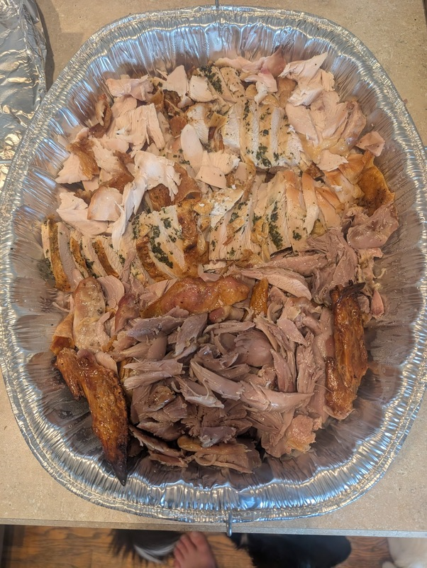
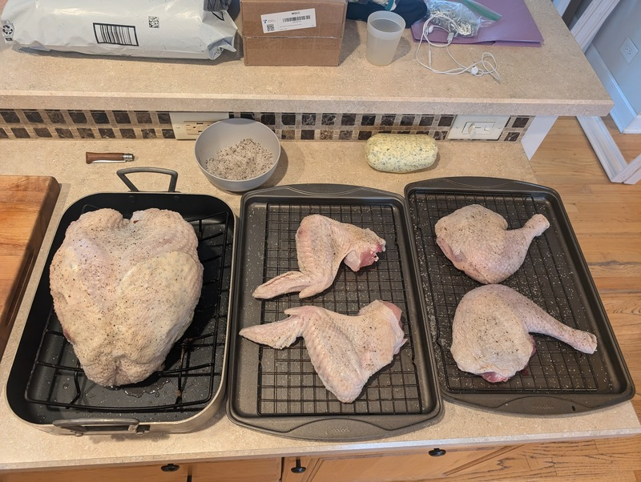
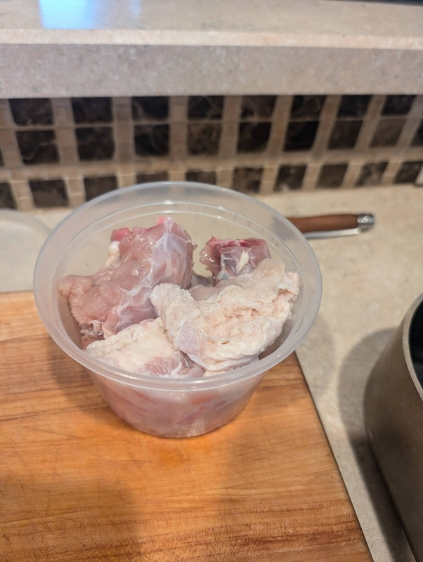
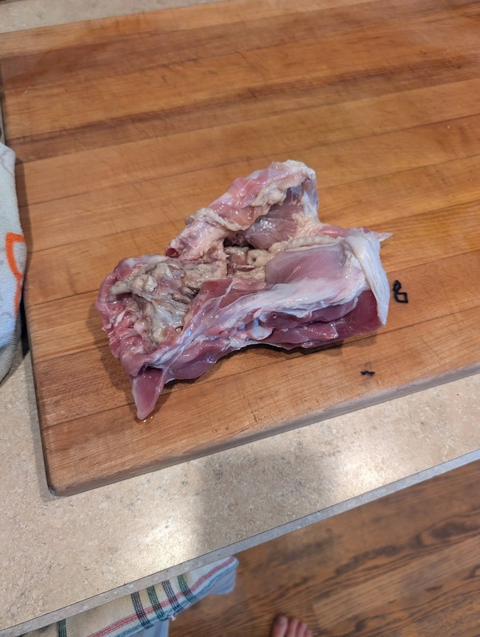
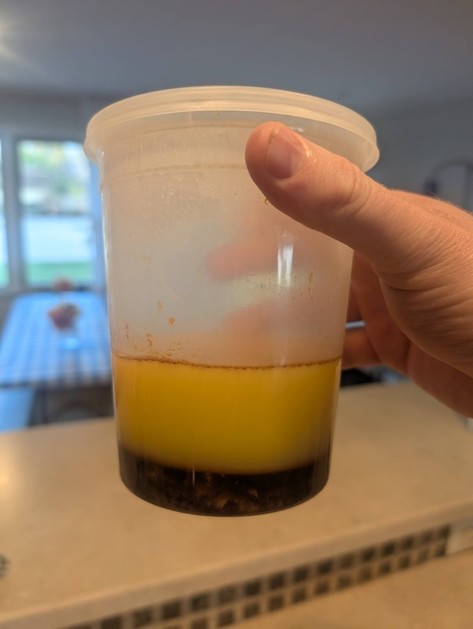
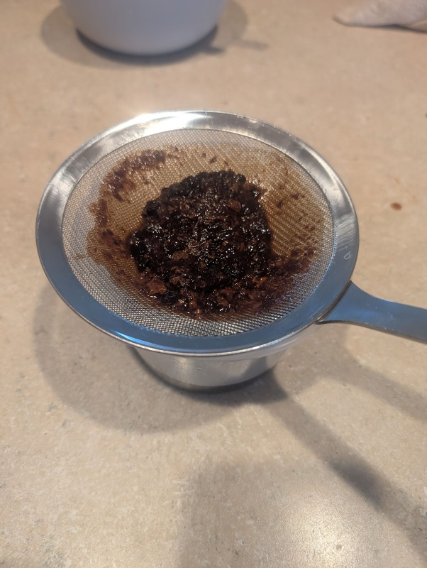
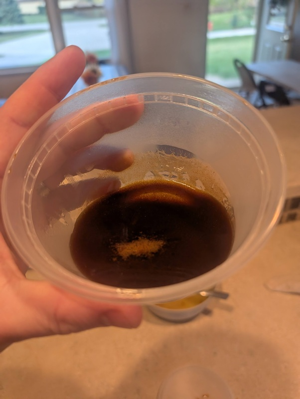

# Turkey

Author: Alex Recker

## Materials

- roasting pan with ham rack
- baking sheets with wire racks (2)
- turkey, completely thawed and dried
- kosher salt and pepper, mixed (excess)
- [herb butter](./herb-butter.md), room temperature (1 cup)
- neutral oil (e.g. sunflower oil) (excess)
- [turkey stock](./turkey-stock.md) (1 quart)

## Procedure

### Prepping

1. Using a boning knife, separate the wings and thigh quarters from the turkey.  Rinse the parts under cold water and dry.  Set these aside on top of baking sheet with wire racks, the 2 thighs quarters on one sheet and the 2 wings on the second sheet.

2. Gently bend the lower part of the back away from the front of the bird.  Use a boning knife to finish the cut.  Set aside the lower back.

3. Rinse the breast and cage of the bird under cold water and dry.  Use the salt and pepper mixture to season the inside of the cavity and place on the ham rack.

4. Loosen the skin covering the breast.  Fill the space under the skin with herb butter and smooth it out over the chest like a breastplate.

5. Use the salt and pepper mixture to season the outside of the breast.

6. Use the salt and pepper mixture to season both sides of the wings and leg quarters.

7. **Optional**: use a cleaver to cut the neck into chunks.  Use a boning knife to remove the "oyster" meat from the lower back of the turkey.  Set all these aside to make [turkey jous](./turkey-jous.md) for the gravy.

8. Place the roasting dish and the two baking sheets in the fridge uncovered for 24-48 hours.

**Notes**

The neck and back meat can be seared later to enhance the stock used to make the gravy.

This is the back piece I remove from the breast/cage of the bird.  You can keep it to make stock or soups, but I don't like to use seasoned meat in stocks (by now I have [brined](./turkey-brine.md) my turkey) so I just remove some of the back meat and throw it away.

### Baking

The wings, leg quarters, and breasts are baked independently, but the temperatures are the same so you can combine them if you have a roomy oven.

#### Wings

1. Pre-heat the oven to 450F with convection.

2. Remove the baking sheet of wings from the fridge.  Take out wire rack and clean the blood and excess salt off the baking sheet and line it with a piece of tinfoil.  Add the wire rack with wings back on top.

3. Coat the top of the wings lightly with oil.  Place the wings in the oven and turn the heat down to 350F.

4. Bake for 90 minutes or until the wing tips begin to burn.

5. Remove the sheet from the oven and tent in foil.  Let the wings rest for 1 hour.

6. Remove the meat from the bone.  It should fall off very easily.  Move the meat to a serving tray and refridgerate.

#### Leg Quarters

1. Pre-heat the oven to 450 with convection.

2. Remove the baking sheet of leg quarters from the fridge.  Take out wire rack and clean the blood and excess salt off the baking sheet and line it with a piece of tinfoil.  Add the wire rack with leg quarters back on top.

3. Coat the top of the leg quarters with oil.  Place the leg quarters in the oven and turn the heat down to 350F.

4. Bake for 2 hours or until the temperature in the deep thigh registers 180F.

5. Remove the sheet from the oven and tent in foil. Let the leg quarters rest for 1 hour.

6. Remove the meat from the bone.  It should fall off very easily.  Move the meat to a serving tray and refrigerate.

#### Breasts

1. Pre-heat the oven to 450 with convection.

2. Remove the roasting rack with the breasts from the roasting dish.  Clean the blood and excess salt off the bottom and place the rack back in the dish.

3. Warm up the turkey stock and dump half of it (2 cups) it in the bottom of the roasting dish.

4. Lightly cover the top of the breasts with oil.  Place in the oven and turn the heat down to 350F.

5. Rotate the roasting dish every hour.  Bake for 2 hours or until the temperature in the deep breast registers 155F.

6. Remove the roasting dish and tent in foil.  Let the breasts rest for 1 hour.

7. Remove the breasts from the roasting rack.  Carve the meat off the cage and move the meat to a serving tray and refridgerate.

8. Warm up the roasting dish to loosen up the drippings.  Deglaze if needed.  Collect the liquid and bits into a cup and refrigerate.

### Drippings

Baking the breasts in a roasting tray produces delicious drippings that can enhance our turkey, stuffing, and gravy.  But it also contains a lot of fat and impurities that can ruin the mouth feel of your dishes.

By placing the drippings in the fridge, you can encourage the fat and butter to separate from the liquid.

Scoop off this waxy layer of fat and dicard.  Warm up the liquid in the microwave and pour it through a strainer, tamping it through with a spoon.

Add the cleaned concentrated drippings back into the remaining turkey stock to make the final drippings.  Add salt to taste, but chances are that it's already salty enough.

### Serving

1. Remove the serving tray from the fridge.  Add a few splashes of drippings to the tray[^1]

2. Warm up the tray in the oven and serve.[^2]

[^1]: add the rest of the drippings to the stuffing and gravy.
[^2]: don't leave the turkey out more than 2 hours, always place it back in the fridge.
